## Biglake

**Preparation :**

1. Activate Cloud Shell

   List the active account name `gcloud auth list`

   List the project ID : `gcloud config list project`

#### Task 1. Create a connection resource

1. From the Navigation Menu, go to BigQuery > Studio. Click Done.
2. To create a connection, switch to Explorer tab and click + Add data. Then use the search bar for data sources to search for Vertex AI. Click on the result for Vertex AI.
3. In the Access external data in place, select BigQuery Federation.

    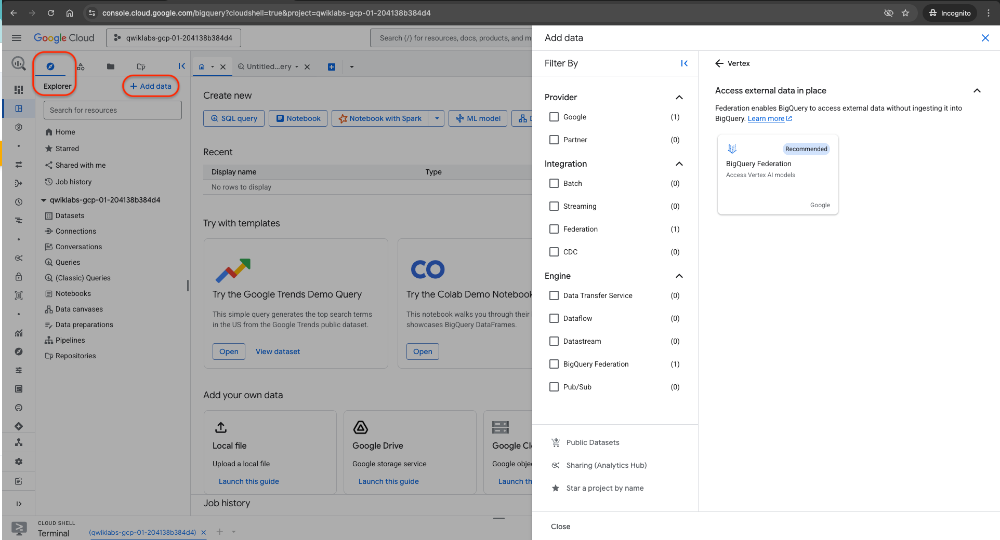
4. In the Connection type list, select Vertex AI remote models, remote functions and BigLake (Cloud Resource).
5. In the Connection ID field, type my-connection.
6. For Location type, choose Multi-region and select US (multiple regions in United States) from dropdown.
7. Click Create connection.

    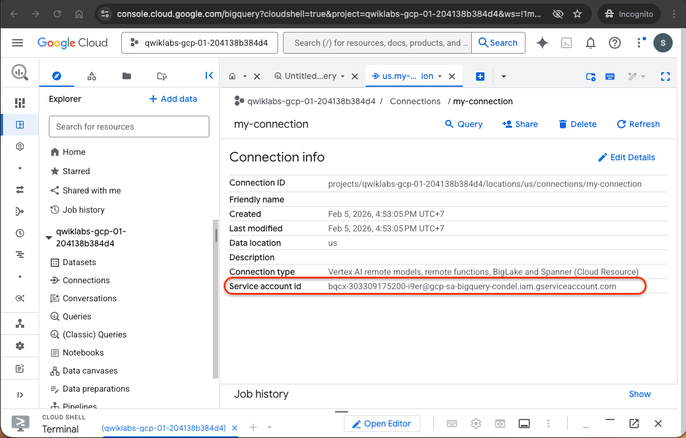

copy service account for next step.

#### Task 2. Set up access to a Cloud Storage data lake

The new connection resource read-only access to the Cloud Storage data lake so that BigQuery can access Cloud Storage files on behalf of users.

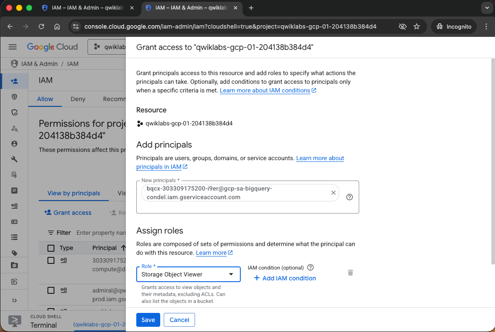

#### Task 3. Create a BigLake table

**Create Dataset**

Switch to Classic Explorer and click the three dots next to your project name, then select Create dataset.

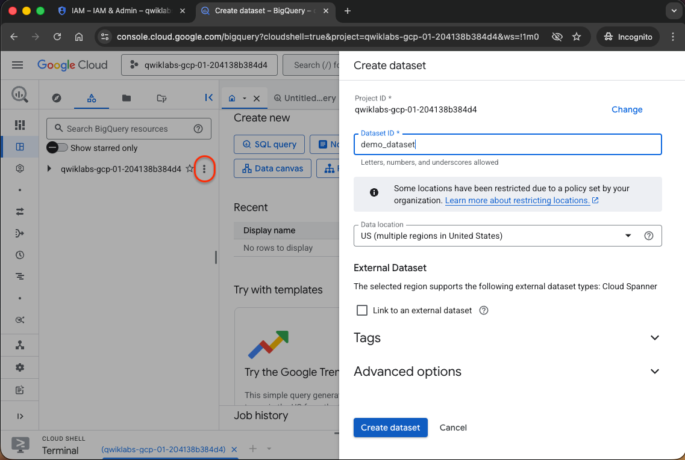

**Create the table**

Click on three dots next to demo_dataset, then choose Create table.

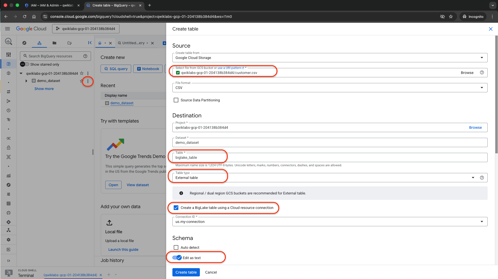 <br>

For Schema, enable Edit as text and copy and paste the following schema into the text box:

```
[
{
    "name": "customer_id",
    "type": "INTEGER",
    "mode": "REQUIRED"
  },
  {
    "name": "first_name",
    "type": "STRING",
    "mode": "REQUIRED"
  },
  {
    "name": "last_name",
    "type": "STRING",
    "mode": "REQUIRED"
  },
  {
    "name": "company",
    "type": "STRING",
    "mode": "NULLABLE"
  },
  {
    "name": "address",
    "type": "STRING",
    "mode": "NULLABLE"
  },
  {
    "name": "city",
    "type": "STRING",
    "mode": "NULLABLE"
  },
  {
    "name": "state",
    "type": "STRING",
    "mode": "NULLABLE"
  },
  {
    "name": "country",
    "type": "STRING",
    "mode": "NULLABLE"
  },
  {
    "name": "postal_code",
    "type": "STRING",
    "mode": "NULLABLE"
  },
  {
    "name": "phone",
    "type": "STRING",
    "mode": "NULLABLE"
  },
  {
    "name": "fax",
    "type": "STRING",
    "mode": "NULLABLE"
  },
  {
    "name": "email",
    "type": "STRING",
    "mode": "REQUIRED"
  },
  {
    "name": "support_rep_id",
    "type": "INTEGER",
    "mode": "NULLABLE"
  }
]
```


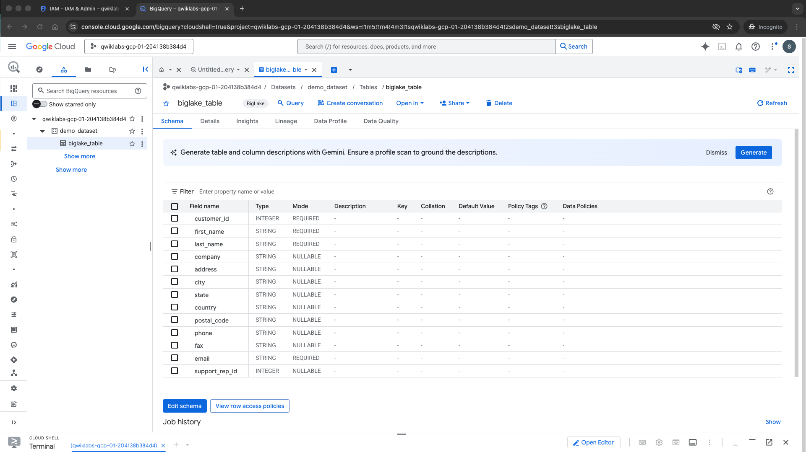

#### Task 4. Query a BigLake table through BigQuery

run the query:
```sql
SELECT * FROM `Project ID.demo_dataset.biglake_table`
```

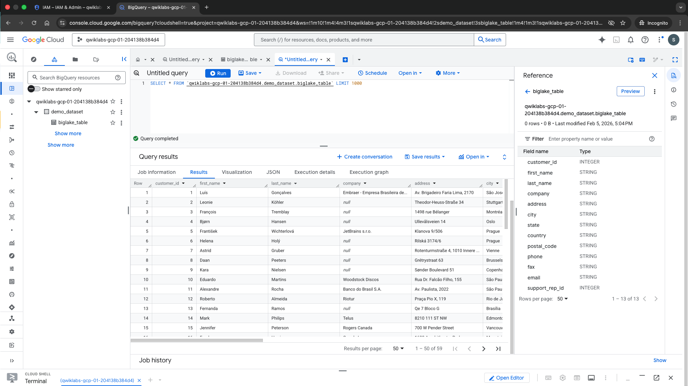

#### Task 5. Set up access control policies

Add policy tags to columns

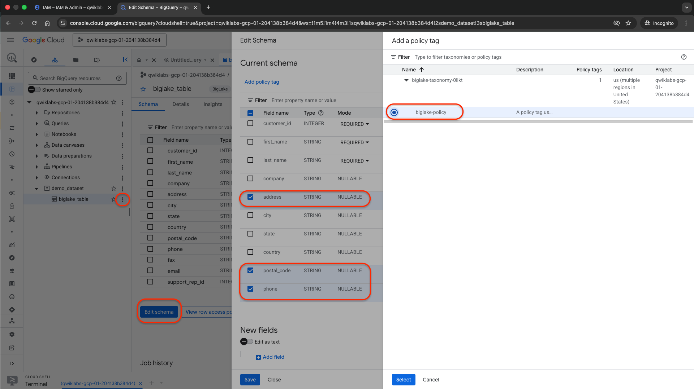 <br>

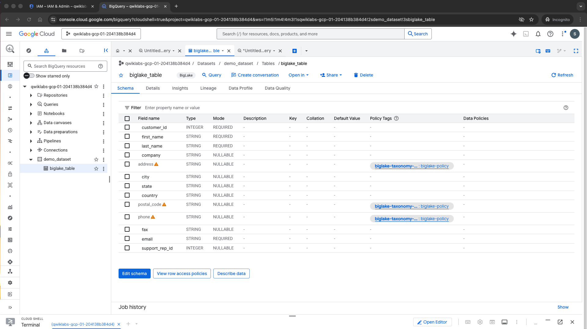

**Verify the column level security**

```sql
SELECT * FROM `Project ID.demo_dataset.biglake_table`
```

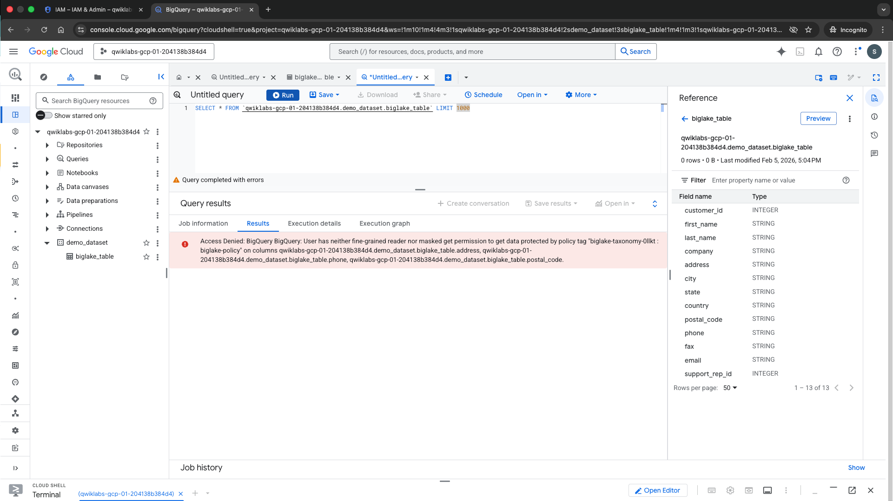 <br>

```sql
SELECT *  EXCEPT(address, phone, postal_code)
FROM `Project ID.demo_dataset.biglake_table`
```

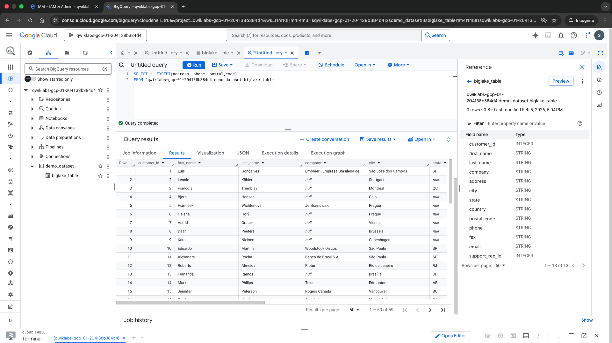 <br>

#### Task 6. Upgrade external tables to BigLake tables

##### Create the external table

1. Click three dots next to demo_dataset, then choose Create table.

2. For Create table from, choose Google Cloud Storage from the dropdown.

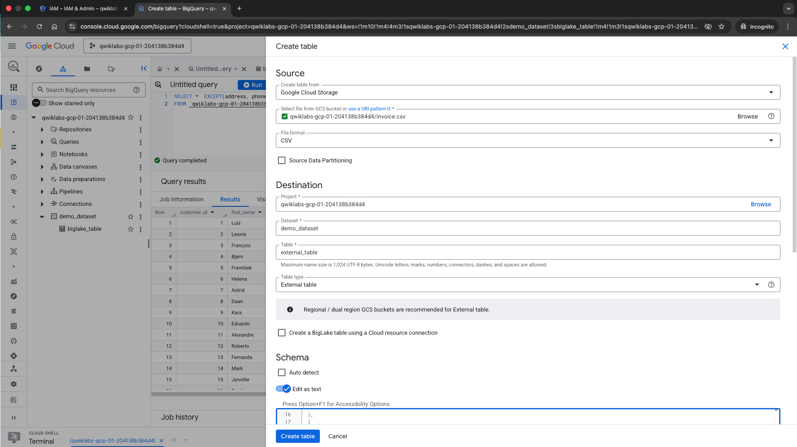 <br>

For Schema, enable Edit as text and copy and paste the following schema into the text box:

```
[
{
    "name": "invoice_id",
    "type": "INTEGER",
    "mode": "REQUIRED"
  },
  {
    "name": "customer_id",
    "type": "INTEGER",
    "mode": "REQUIRED"
  },
  {
    "name": "invoice_date",
    "type": "TIMESTAMP",
    "mode": "REQUIRED"
  },
  {
    "name": "billing_address",
    "type": "STRING",
    "mode": "NULLABLE"
  },
  {
    "name": "billing_city",
    "type": "STRING",
    "mode": "NULLABLE"
  },
  {
    "name": "billing_state",
    "type": "STRING",
    "mode": "NULLABLE"
  },
  {
    "name": "billing_country",
    "type": "STRING",
    "mode": "NULLABLE"
  },
  {
    "name": "billing_postal_code",
    "type": "STRING",
    "mode": "NULLABLE"
  },
  {
    "name": "total",
    "type": "NUMERIC",
    "mode": "REQUIRED"
  }
]
```

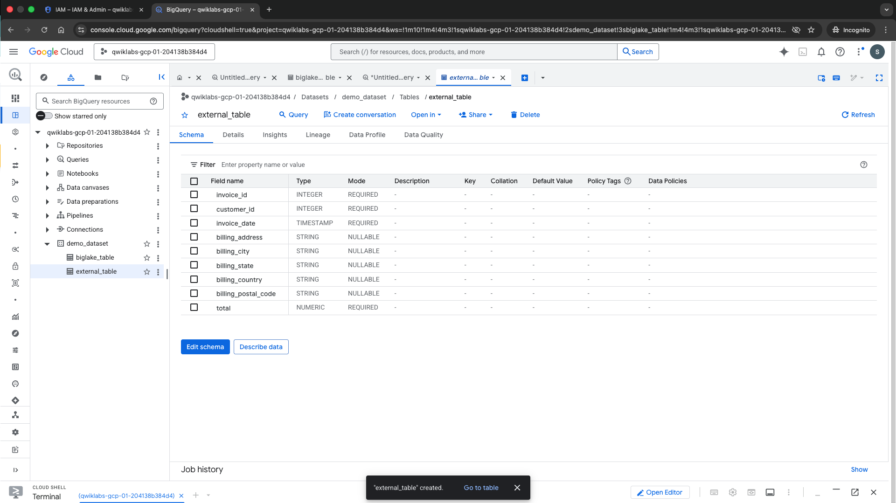 <br>

##### Update external table to Biglake table

1. Open a new Cloud Shell window and run the following command to generate a new external table definition that specifies the connection to use:
    ```sql
    export PROJECT_ID=$(gcloud config get-value project)
    bq mkdef \
    --autodetect \
    --connection_id=$PROJECT_ID.US.my-connection \
    --source_format=CSV \
    "gs://$PROJECT_ID/invoice.csv" > /tmp/tabledef.json
    ```

2. Verify your table definition has been created:

    `cat /tmp/tabledef.json`

3. Get the schema from your table:

    ```sql bq show --schema --format=prettyjson  demo_dataset.external_table > /tmp/schema```

4. Update the table using the new external table definition:

    ```sql bq update --external_table_definition=/tmp/tabledef.json --schema=/tmp/schema demo_dataset.external_table```

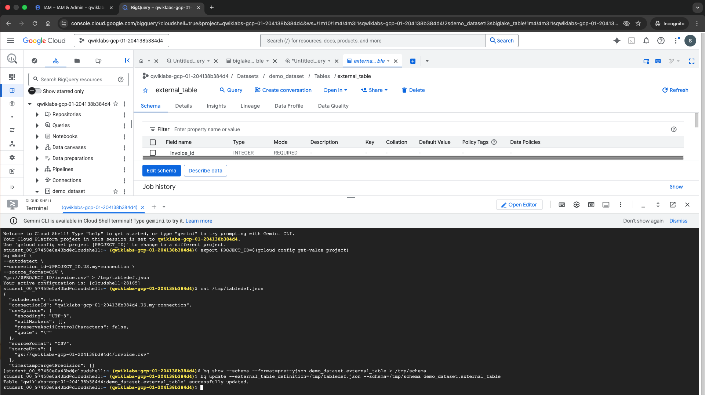 <br>

##### Verify the updated table

From the Navigation Menu, go to BigQuery > Studio.

Navigate to demo-dataset > and click external_table.

Open the Details tab.

Verify under External Data Configuration that the table is now using the proper Connection ID.

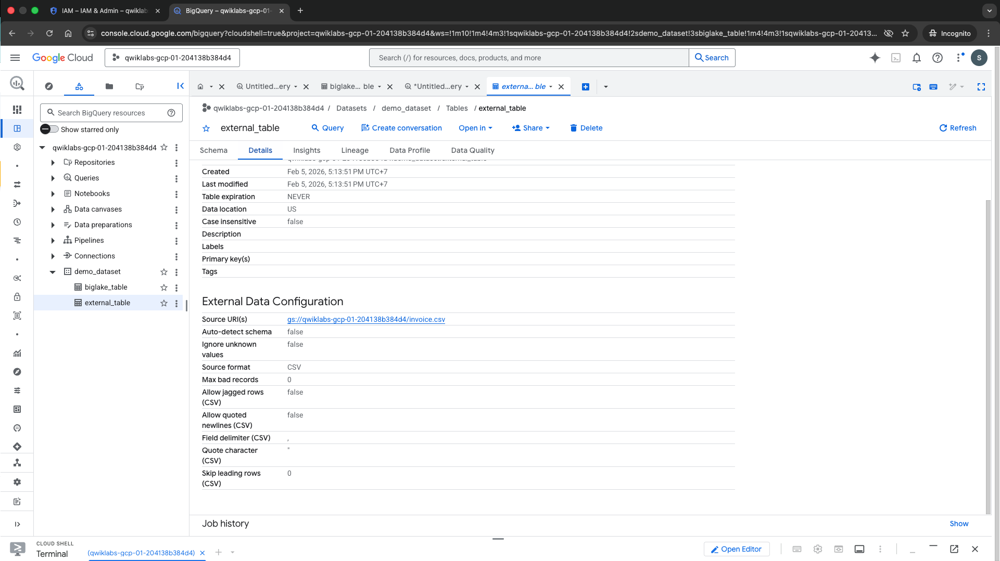 <br>