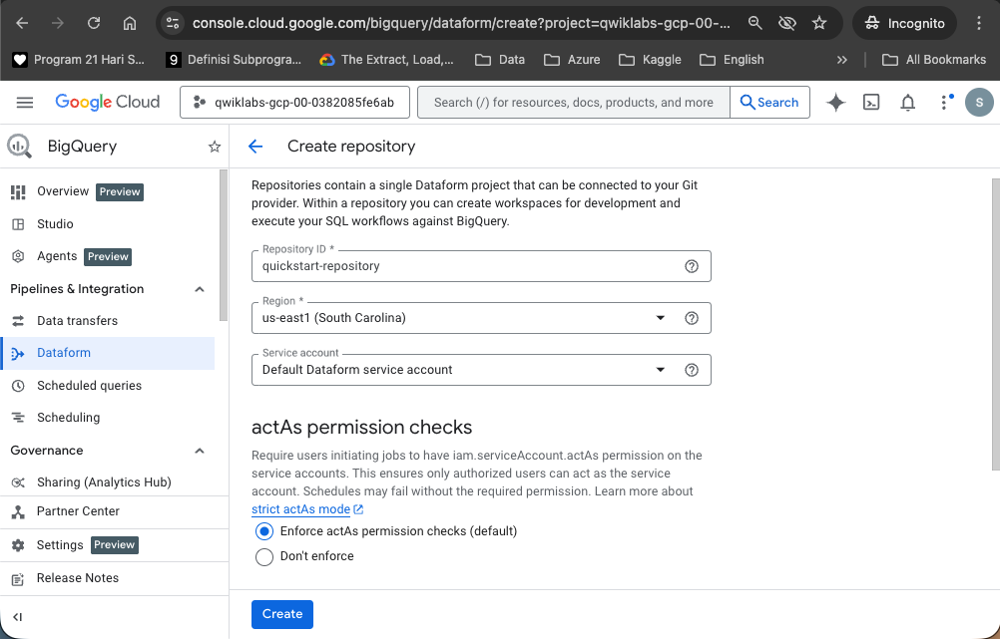
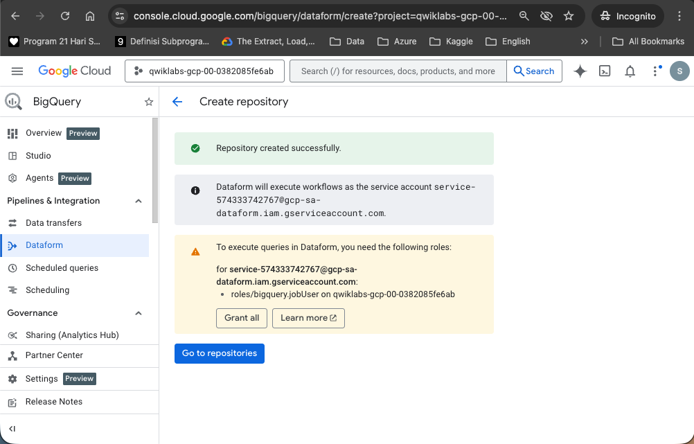
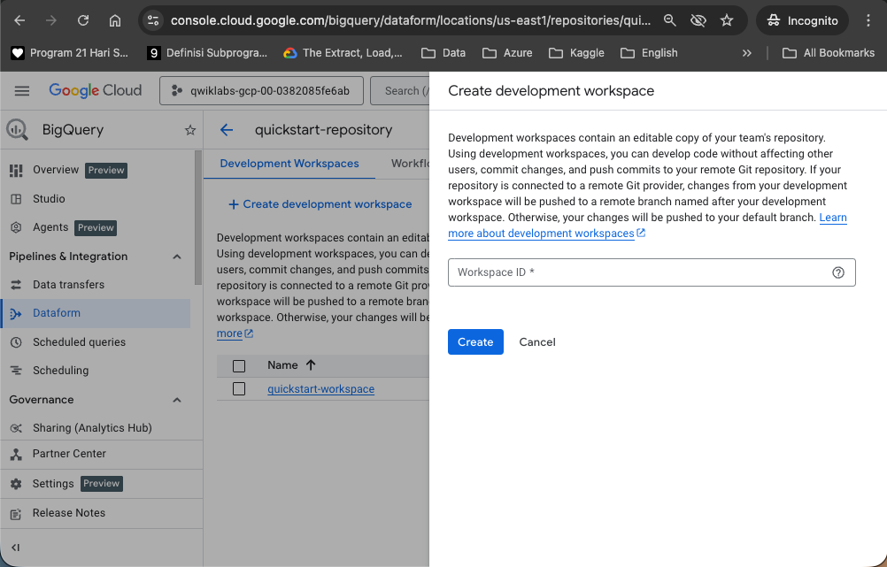
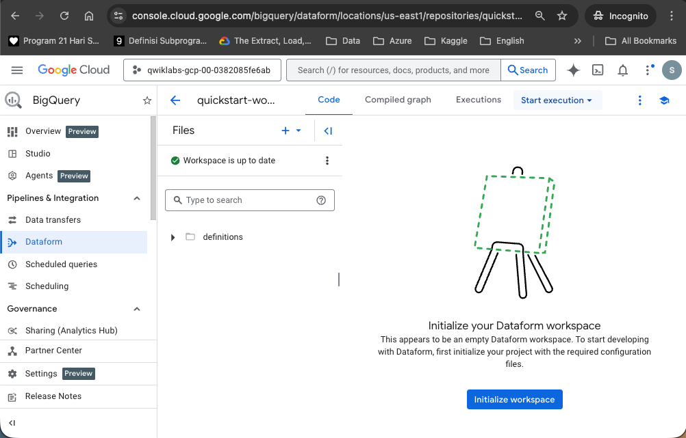
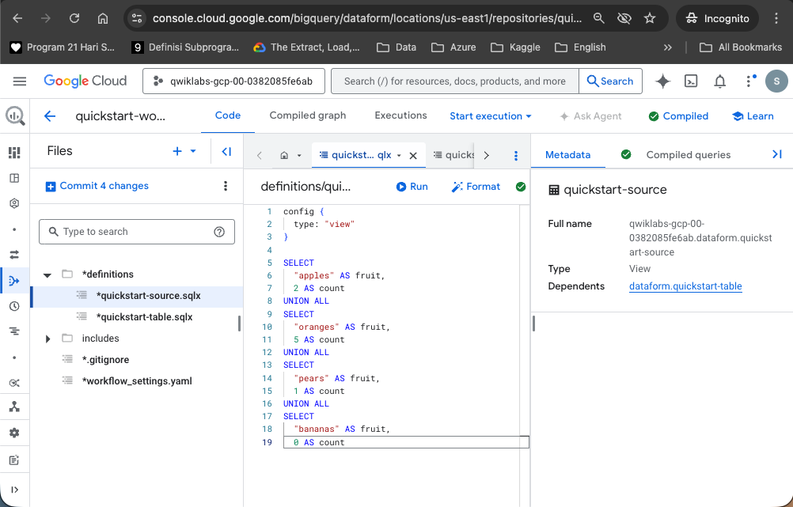
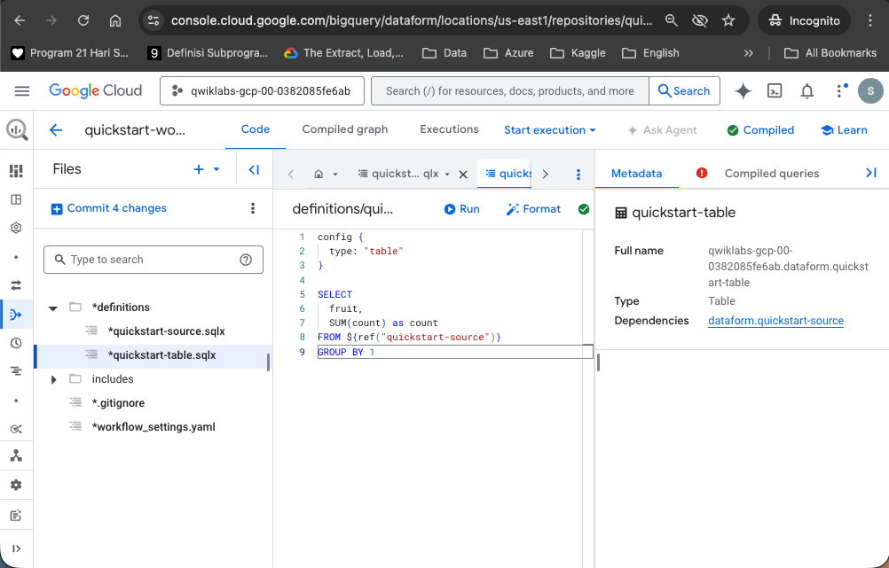
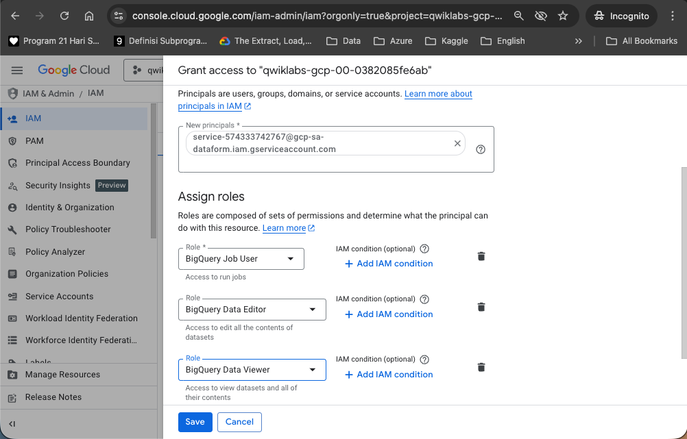
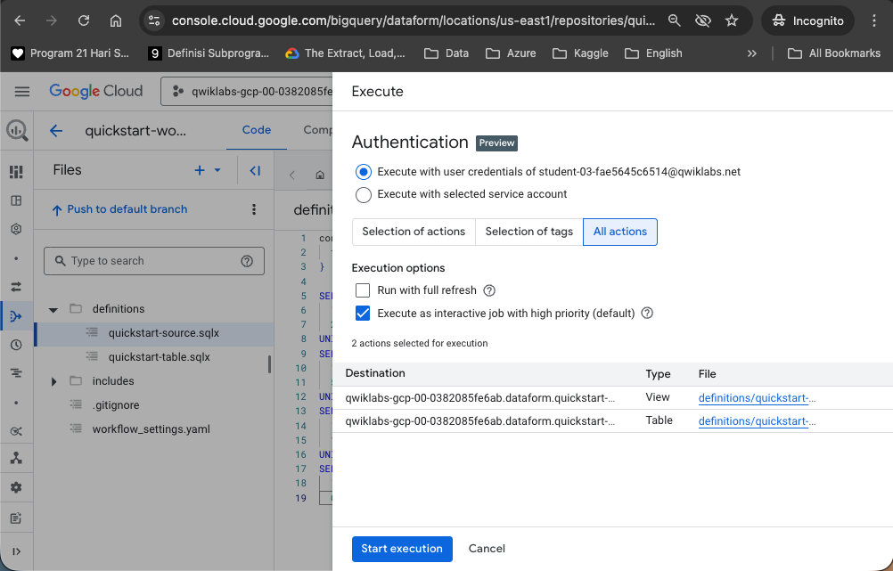
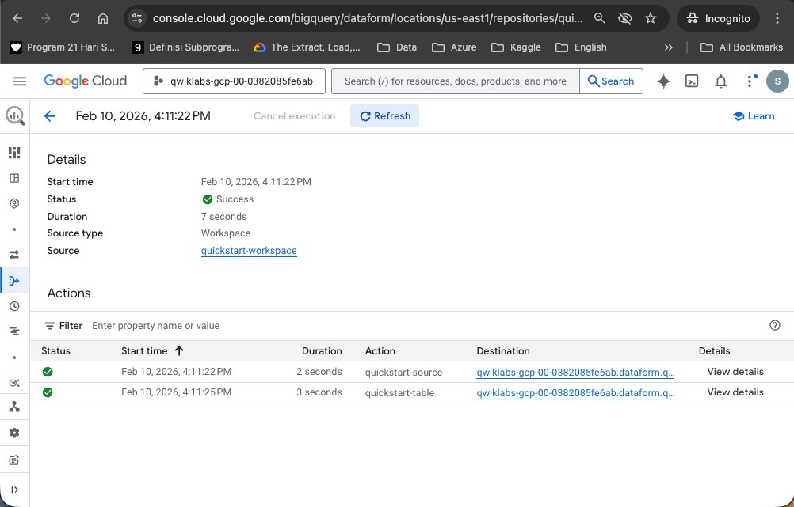

## SQL Workflow in Dataform

Create and execute a SQL workflow in Dataform to load data in BigQuery.

#### Task 1. Create a Dataform repository

1. From the Navigation Menu, go to BigQuery > Dataform
2. In the Repository ID field, enter quickstart-repository.
3. In the Region list, select us-east1, click Create 

 <br>



#### Task 2. Create and initialize a Dataform development workspace.

On the Dataform page, click on the quickstart-repository repository you just created.

Click CREATE DEVELOPMENT WORKSPACE.

In the Create development workspace window, do the following:

In the Workspace ID field, enter quickstart-workspace.

<br>

Once created, click on the quickstart-workspace development workspace.

Click INITIALIZE WORKSPACE.



#### Task 3. Create and execute a SQL workflow.

**Create a SQLX file for defining a view**



Enter the following code: 

```sql
config {
  type: "view"
}

SELECT
  "apples" AS fruit,
  2 AS count
UNION ALL
SELECT
  "oranges" AS fruit,
  5 AS count
UNION ALL
SELECT
  "pears" AS fruit,
  1 AS count
UNION ALL
SELECT
  "bananas" AS fruit,
  0 AS count

```

**Create a SQLX file for table definition**



#### Task 4. Grant Dataform access to BigQuery




#### Task 5. Execute the workflow

 <br>

