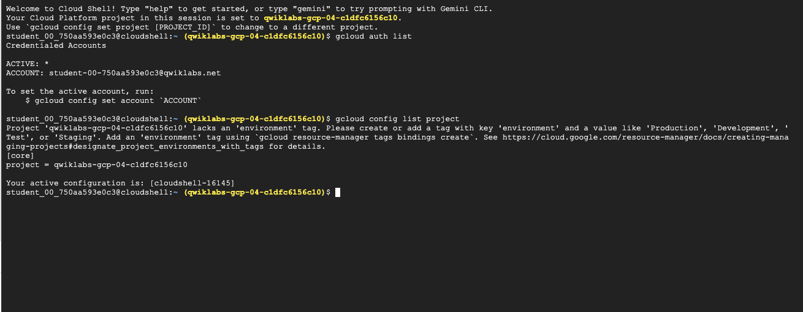
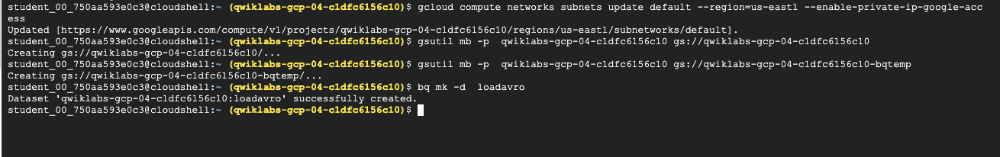
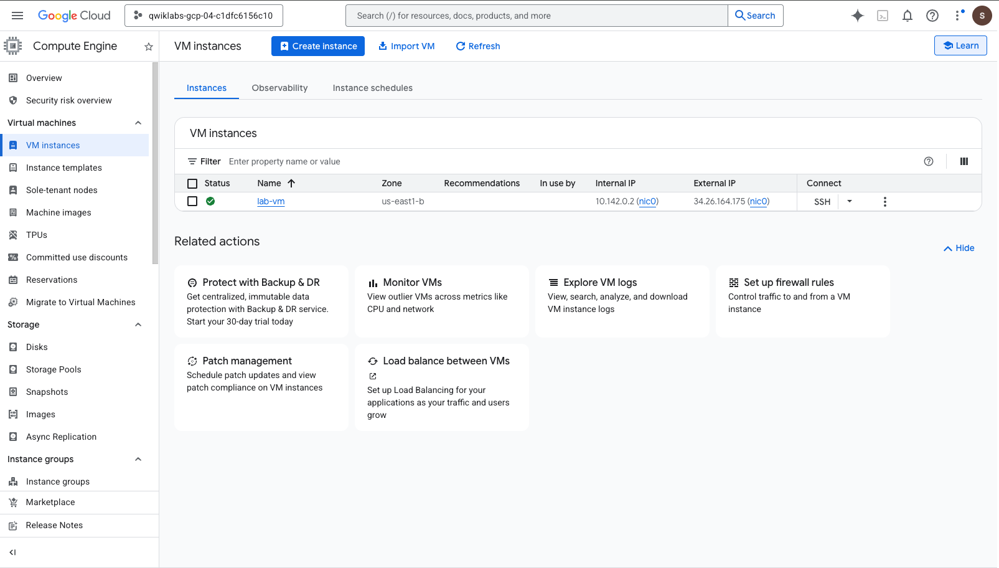
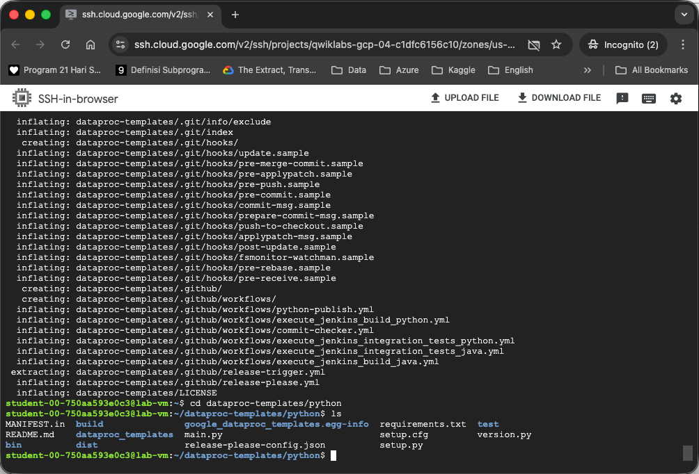
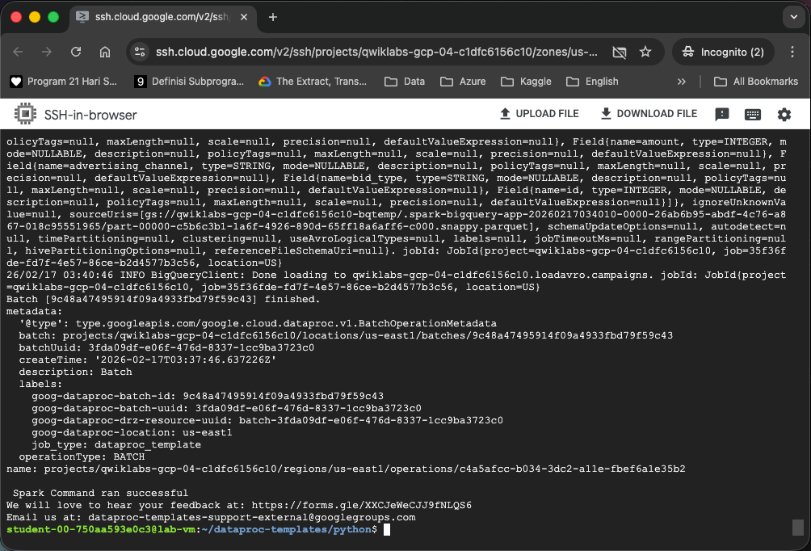
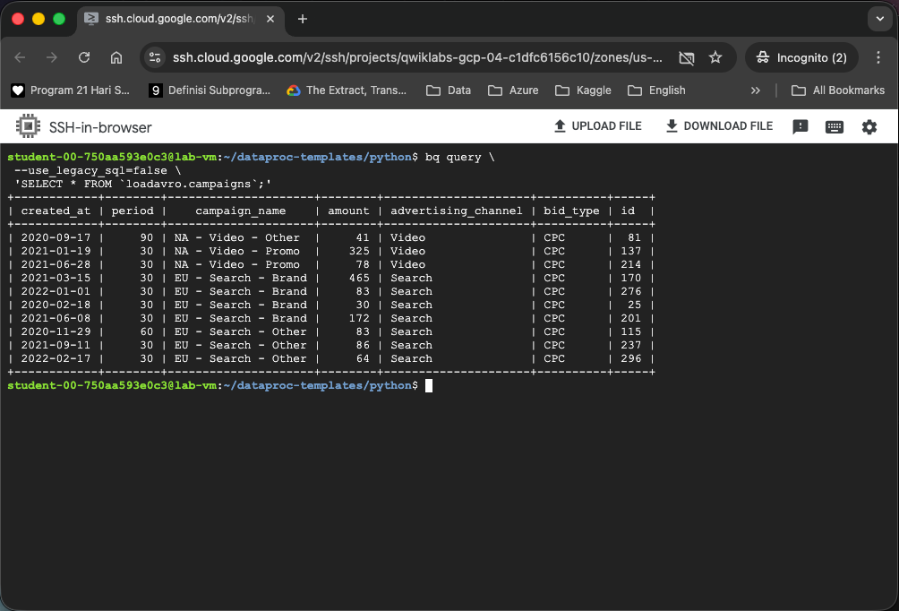

## Use Serverless for Apache Spark to Load BigQuery

Executed a Batch workload using Serverless for Apache Spark for Spark to load an Avro file into a BigQuery table.

Preparation:

Activate Cloud Shell

   List the active account name `gcloud auth list`

   List the project ID : `gcloud config list project`



### Task 1. Complete environment configuration tasks

1. Enable Private IP Access:

   `gcloud compute networks subnets update default --region=REGION --enable-private-ip-google-access`


2. Create a new Cloud Storage bucket as a staging location:

    `gsutil mb -p  PROJECT_ID gs://PROJECT_ID`


3. Create a new Cloud Storage bucket as temporary location for BigQuery while it creates and loads a table

    `gsutil mb -p  PROJECT_ID gs://PROJECT_ID-bqtemp`

4. Create a BQ dataset to store the data `bq mk -d  loadavro`



### Task 2. Download lab assets

You will perform the rest of the steps in the lab inside the Compute Engine VM. SSH to the VM:



1. Download the Avro file that will be processed for storage in BigQuery

   `wget https://storage.googleapis.com/cloud-training/dataengineering/lab_assets/idegc/campaigns.avro`

2. Move the Avro file to the staging Cloud Storage bucket you created earlier

    `gcloud storage cp campaigns.avro gs://PROJECT_ID`

3. Download an archive containing the Spark code to be executed against the Serverless environment.

    `wget https://storage.googleapis.com/cloud-training/dataengineering/lab_assets/idegc/dataproc-templates.zip`

4. Extract the archive `unzip dataproc-templates.zip`

5. Change to the Python directory `cd dataproc-templates/python`

### Task 3. Configure and execute the Spark code

Set a few environment variables into VM instance terminal and execute a Spark template to load data into BigQuery.

1. Set the following environment variables for the Serverless for Apache Spark environment

   ```
   export GCP_PROJECT=PROJECT_ID
    export REGION=REGION
    export GCS_STAGING_LOCATION=gs://PROJECT_ID
    export JARS=gs://cloud-training/dataengineering/lab_assets/idegc/spark-bigquery_2.12-20221021-2134.jar
    ```


2. Run the following code to execute the Spark Cloud Storage to BigQuery template to load the Avro file in to BigQuery

    ```
    ./bin/start.sh \
    -- --template=GCSTOBIGQUERY \
        --gcs.bigquery.input.format="avro" \
        --gcs.bigquery.input.location="gs://PROJECT_ID" \
        --gcs.bigquery.input.inferschema="true" \
        --gcs.bigquery.output.dataset="loadavro" \
        --gcs.bigquery.output.table="campaigns" \
        --gcs.bigquery.output.mode=overwrite\
        --gcs.bigquery.temp.bucket.name="PROJECT_ID-bqtemp"
    ```


### Task 4. Confirm that the data was loaded into BigQuery

View the data in the new table in BigQuery

   ```
   bq query \
    --use_legacy_sql=false \
    'SELECT * FROM `loadavro.campaigns`;'
   ```

