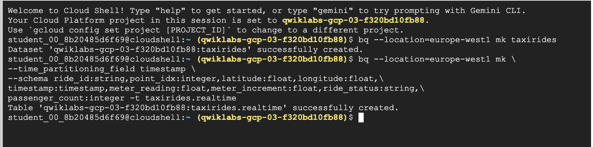
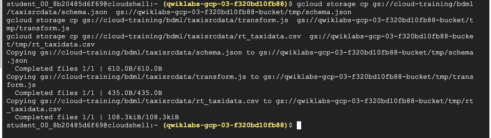
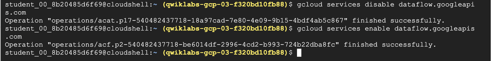
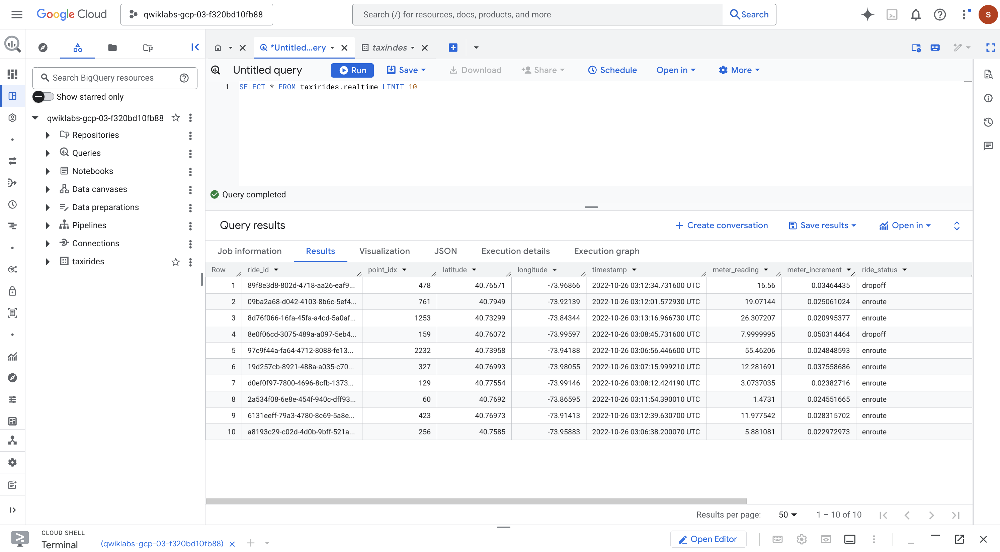
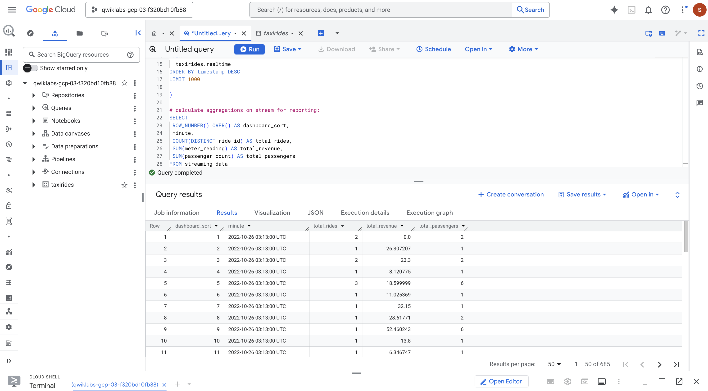

## Creating a Streaming Data Pipeline for a Real-Time Dashboard with Dataflow

Build a streaming data pipeline to capture taxi revenue, passenger count, ride status, and much more, and then visualize the results in a management dashboard.

Create a Dataflow job from a template

Stream a Dataflow pipeline into BigQuery

Monitor a Dataflow pipeline in BigQuery

Analyze results with SQL

Visualize key metrics in Looker Studio

Preparation:

Activate Cloud Shell

List the active account name `gcloud auth list`

List the project ID : `gcloud config list project`


### Task 1. Create a BigQuery dataset

1. Create the taxirides dataset.

   `bq --location=Region mk taxirides`

2. Create the taxirides.realtime table (empty schema that you will stream into later).

   `bq --location=Region mk \
--time_partitioning_field timestamp \
--schema ride_id:string,point_idx:integer,latitude:float,longitude:float,\
timestamp:timestamp,meter_reading:float,meter_increment:float,ride_status:string,\
passenger_count:integer -t taxirides.realtime`



### Task 2. Copy required lab artifacts

A Cloud Storage bucket was created for you during lab start up.

1. Move files needed for the Dataflow job

    ```
    gcloud storage cp gs://cloud-training/bdml/taxisrcdata/schema.json  gs://Project_ID-bucket/tmp/schema.json
    gcloud storage cp gs://cloud-training/bdml/taxisrcdata/transform.js  gs://Project_ID-bucket/tmp/transform.js
    gcloud storage cp gs://cloud-training/bdml/taxisrcdata/rt_taxidata.csv  gs://Project_ID-bucket/tmp/rt_taxidata.csv
    ```



### Task 3. Set up a Dataflow Pipeline

In this task, you set up a streaming data pipeline to read files from your Cloud Storage bucket and write data to BigQuery.

Dataflow is a serverless way to carry out data analysis.

1. Restart the connection to the Dataflow API

```sh
gcloud services disable dataflow.googleapis.com
gcloud services enable dataflow.googleapis.com
```



2. Create a new streaming pipeline

```sh
./bin/start.sh \
-- --template=GCSTOBIGQUERY \
    --gcs.bigquery.input.format="avro" \
    --gcs.bigquery.input.location="gs://PROJECT_ID" \
    --gcs.bigquery.input.inferschema="true" \
    --gcs.bigquery.output.dataset="loadavro" \
    --gcs.bigquery.output.table="campaigns" \
    --gcs.bigquery.output.mode=overwrite\
    --gcs.bigquery.temp.bucket.name="PROJECT_ID-bqtemp"
```

Equivalent REST response:

```
{
    "id": "2026-02-19_21_08_53-10362018338394705846",
    "projectId": "qwiklabs-gcp-03-f320bd10fb88",
    "name": "streaming-taxi-pipeline",
    "environment": {},
    "currentState": "JOB_STATE_QUEUED",
    "currentStateTime": "2026-02-20T05:08:55.713808Z",
    "createTime": "2026-02-20T05:08:55.713808Z",
    "labels": {
        "goog-dataflow-provided-template-name": "stream_gcs_text_to_bigquery_flex",
        "goog-dataflow-provided-template-version": "2026-02-10-00_rc02",
        "goog-dataflow-provided-template-type": "flex"
    },
    "location": "europe-west1",
    "pipelineDescription": {},
    "startTime": "2026-02-20T05:08:55.713808Z"
}
```



### Task 4. Analyze the taxi data using BigQuery

1.  analyze the data as it is streaming

    `SELECT * FROM taxirides.realtime LIMIT 10`



### Task 5. Perform aggregations on the stream for reporting

1. calculate aggregations on the stream for reporting.

```sql
WITH streaming_data AS (

SELECT
  timestamp,
  TIMESTAMP_TRUNC(timestamp, HOUR, 'UTC') AS hour,
  TIMESTAMP_TRUNC(timestamp, MINUTE, 'UTC') AS minute,
  TIMESTAMP_TRUNC(timestamp, SECOND, 'UTC') AS second,
  ride_id,
  latitude,
  longitude,
  meter_reading,
  ride_status,
  passenger_count
FROM
  taxirides.realtime
ORDER BY timestamp DESC
LIMIT 1000

)

# calculate aggregations on stream for reporting:
SELECT
 ROW_NUMBER() OVER() AS dashboard_sort,
 minute,
 COUNT(DISTINCT ride_id) AS total_rides,
 SUM(meter_reading) AS total_revenue,
 SUM(passenger_count) AS total_passengers
FROM streaming_data
GROUP BY minute, timestamp
```

### Task 6. Stop the Dataflow Job

### Task 7. Create a real-time dashboard

### Task 8. Create a time series dashboard