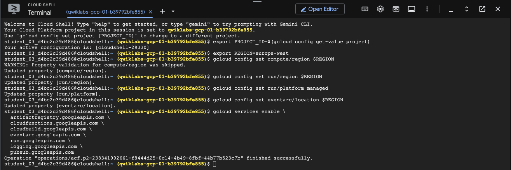
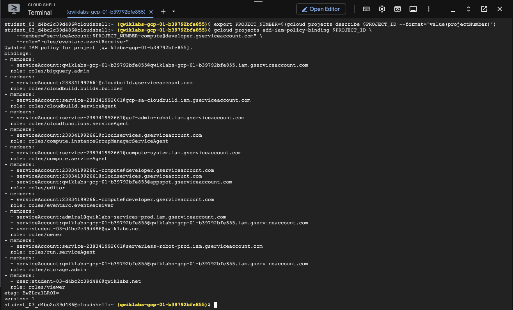
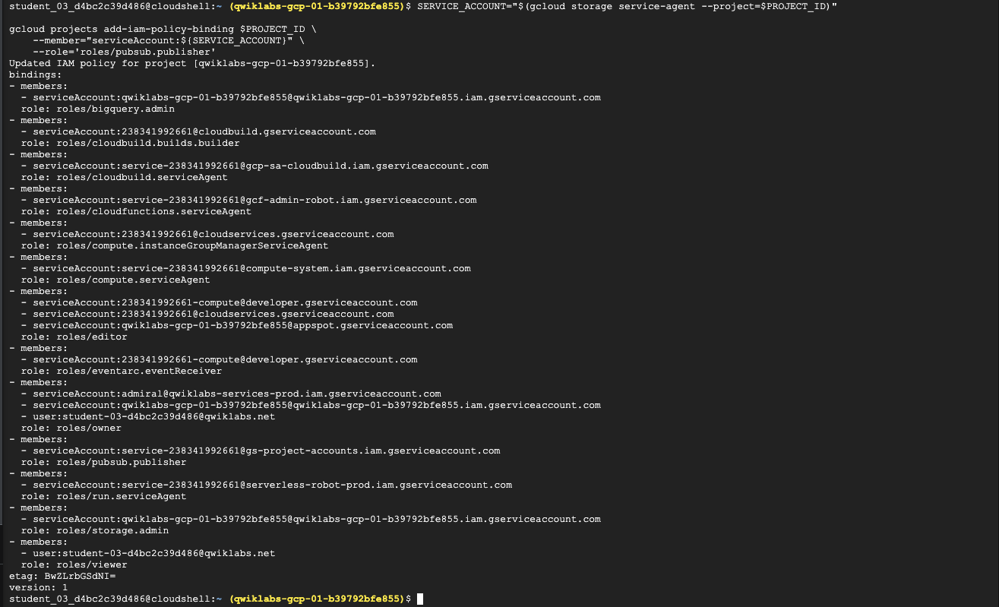
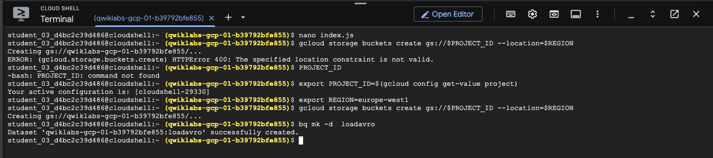
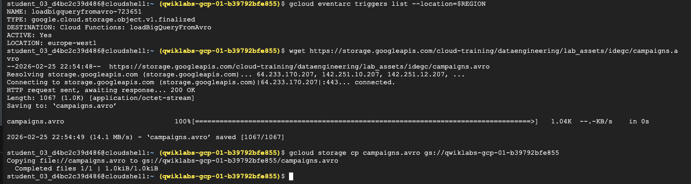
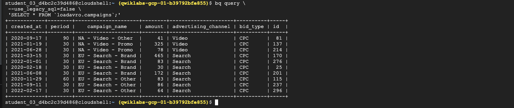
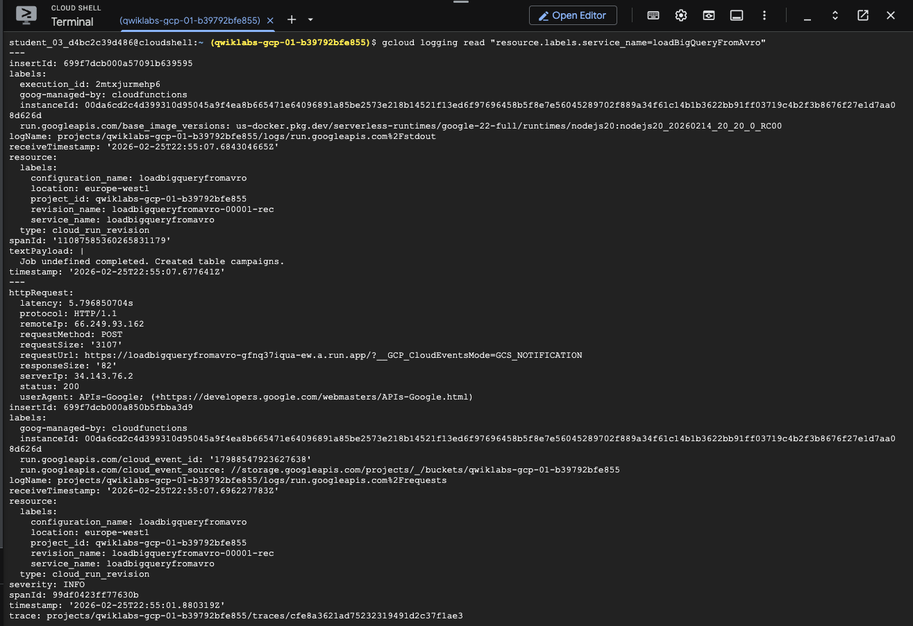

## Creating a Streaming Data Pipeline for a Real-Time Dashboard with Dataflow

Preparation :

Activate Cloud Shell

List the active account name `gcloud auth list`

List the project ID : `gcloud config list project`

### Task 1. Enable APIs

1. Set Project ID

   `export PROJECT_ID=$(gcloud config get-value project)`

2. Set to Region

```bash
   export REGION="REGION"
   gcloud config set compute/region $REGION
```

3. Set Configuration Variables

```bash
   gcloud config set run/region $REGION
   gcloud config set run/platform managed
   gcloud config set eventarc/location $REGION
```

4. Enable APIs

```bash
   gcloud services enable \
   artifactregistry.googleapis.com \
   cloudfunctions.googleapis.com \
   cloudbuild.googleapis.com \
   eventarc.googleapis.com \
   run.googleapis.com \
   logging.googleapis.com \
   pubsub.googleapis.com
```



### Task 2. Set required permissions

1. Set the PROJECT_NUMBER variable

   `export PROJECT_NUMBER=$(gcloud projects describe $PROJECT_ID --format='value(projectNumber)')`

2. Grant the default Compute Engine service account within my project the necessary permissions to receive events from Eventarc:

```bash
    gcloud projects add-iam-policy-binding $PROJECT_ID \
        --member="serviceAccount:$PROJECT_NUMBER-compute@developer.gserviceaccount.com" \
        --role="roles/eventarc.eventReceiver"
```



3. Retrieve the Cloud Storage service agent for my project, and grant it the permission to publish messages to Pub/Sub topics:

```bash
    SERVICE_ACCOUNT="$(gcloud storage service-agent --project=$PROJECT_ID)"

    gcloud projects add-iam-policy-binding $PROJECT_ID \
        --member="serviceAccount:${SERVICE_ACCOUNT}" \
        --role='roles/pubsub.publisher'
```



### Task 3. Create the function

In this task, create a simple function named loadBigQueryFromAvro. This function reads an Avro file that is uploaded to Cloud Storage and then creates and loads a table in BigQuery.

1. Create Function named loadBigQueryFromAvro

```javascript
    /**
    * index.js Cloud Function - Avro on GCS to BQ
    */
    const {Storage} = require('@google-cloud/storage');
    const {BigQuery} = require('@google-cloud/bigquery');

    const storage = new Storage();
    const bigquery = new BigQuery();

    exports.loadBigQueryFromAvro = async (event, context) => {
        try {
            // Check for valid event data and extract bucket name
            if (!event || !event.bucket) {
                throw new Error('Invalid event data. Missing bucket information.');
            }

            const bucketName = event.bucket;
            const fileName = event.name;

            // BigQuery configuration
            const datasetId = 'loadavro';
            const tableId = fileName.replace('.avro', ''); 

            const options = {
                sourceFormat: 'AVRO',
                autodetect: true, 
                createDisposition: 'CREATE_IF_NEEDED',
                writeDisposition: 'WRITE_TRUNCATE',     
            };

            // Load job configuration
            const loadJob = bigquery
                .dataset(datasetId)
                .table(tableId)
                .load(storage.bucket(bucketName).file(fileName), options);

            await loadJob;
            console.log(`Job ${loadJob.id} completed. Created table ${tableId}.`);

        } catch (error) {
            console.error('Error loading data into BigQuery:', error);
            throw error; 
        }
    };
```

### Task 4. Create a Cloud Storage bucket and BigQuery dataset

1. Create a new Cloud Storage bucket as a staging location:

   `gcloud storage buckets create gs://$PROJECT_ID --location=$REGION`

2. Create a BQ dataset to store the data:

   `bq mk -d  loadavro`



### Task 5. Deploy your function

1. Install the two javascript libraries to read from Cloud Storage and store the output in BigQuery:

   `npm install @google-cloud/storage @google-cloud/bigquery`

2. Run the following command to deploy the function:

```bash
    gcloud functions deploy loadBigQueryFromAvro \
    --gen2 \
    --runtime nodejs20 \
    --source . \
    --region $REGION \
    --trigger-resource gs://$PROJECT_ID \
    --trigger-event google.storage.object.finalize \
    --memory=512Mi \
    --timeout=540s \
    --service-account=$PROJECT_NUMBER-compute@developer.gserviceaccount.com 
```

3. Confirm that the trigger was successfully created

`gcloud eventarc triggers list --location=$REGION`

4. Download the Avro file that will be processed by the Cloud Run function for storage in BigQuery

   `wget https://storage.googleapis.com/cloud-training/dataengineering/lab_assets/idegc/campaigns.avro`

5. Move the Avro file to the staging Cloud Storage bucket you created earlier. This action will trigger the Cloud Run function

   `gcloud storage cp campaigns.avro gs://PROJECT_ID`



### Task 6. Confirm that the data was loaded into BigQuery

In this task, you confirm that the data processed by the Cloud Run function has been successfully loaded into BigQuery by querying the loadavro.campaigns table using the bq command.

```bash
    bq query \
    --use_legacy_sql=false \
    'SELECT * FROM `loadavro.campaigns`;'
```

 

### Task 7. View logs

Examine the logs for your Cloud Run function : `gcloud logging read "resource.labels.service_name=loadBigQueryFromAvro"`

 