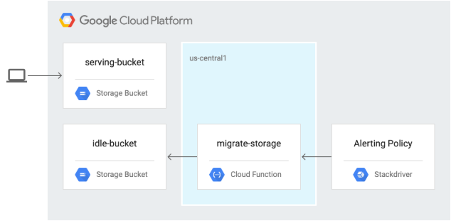
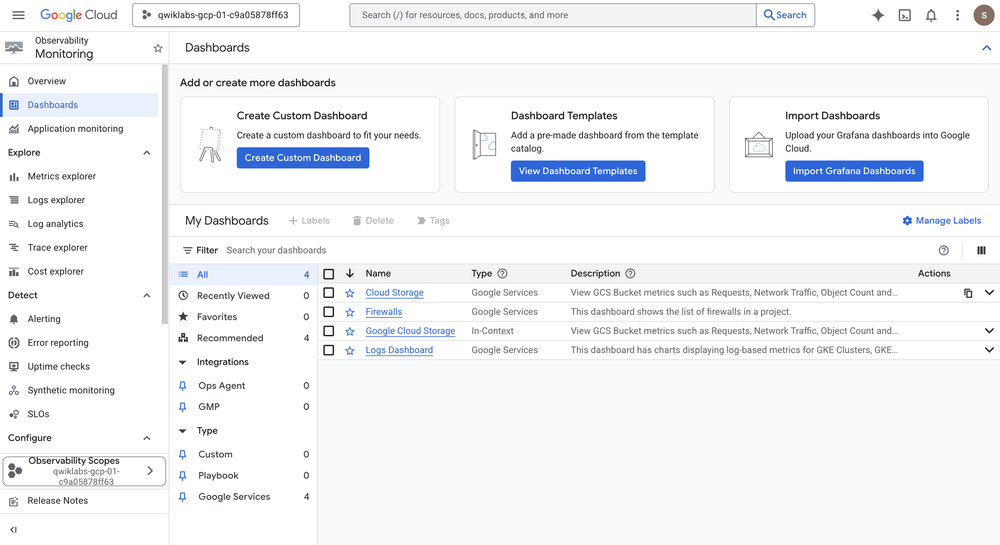
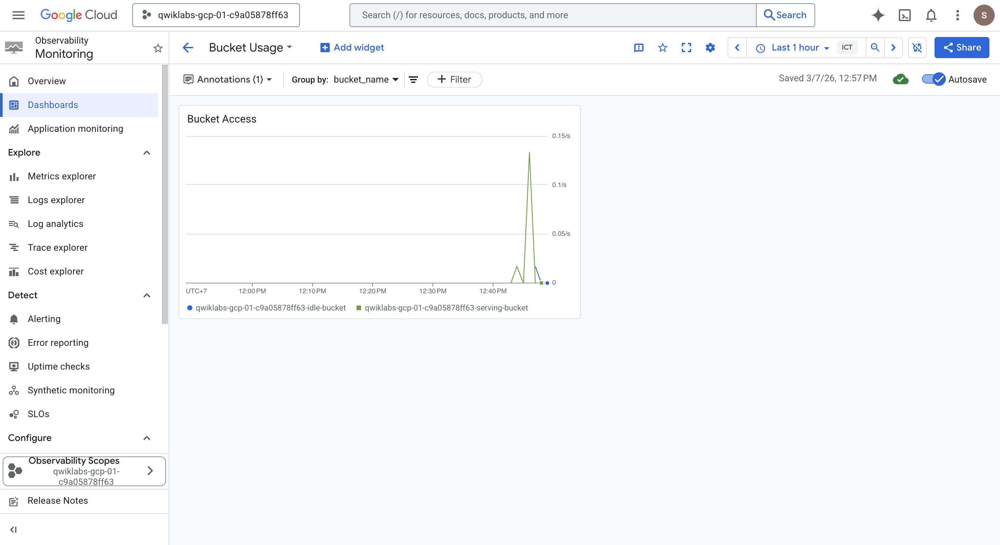
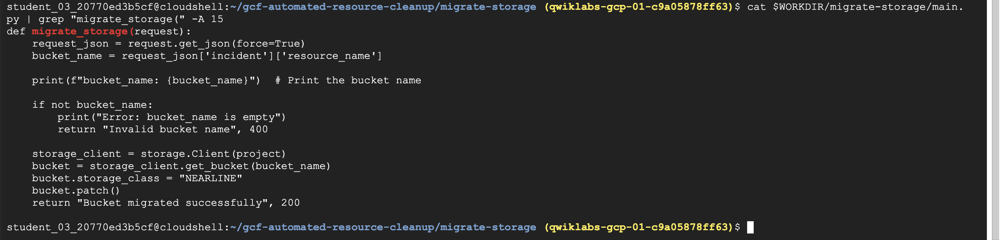
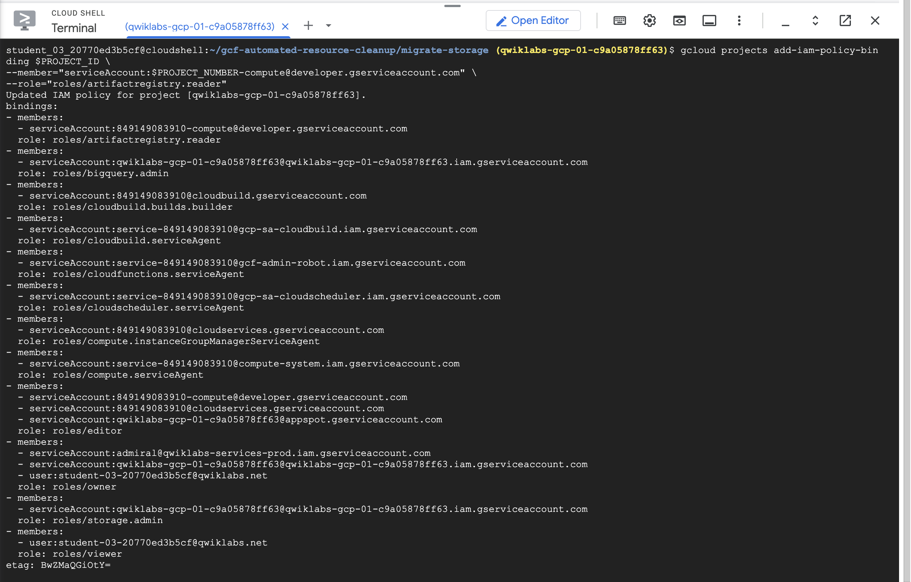
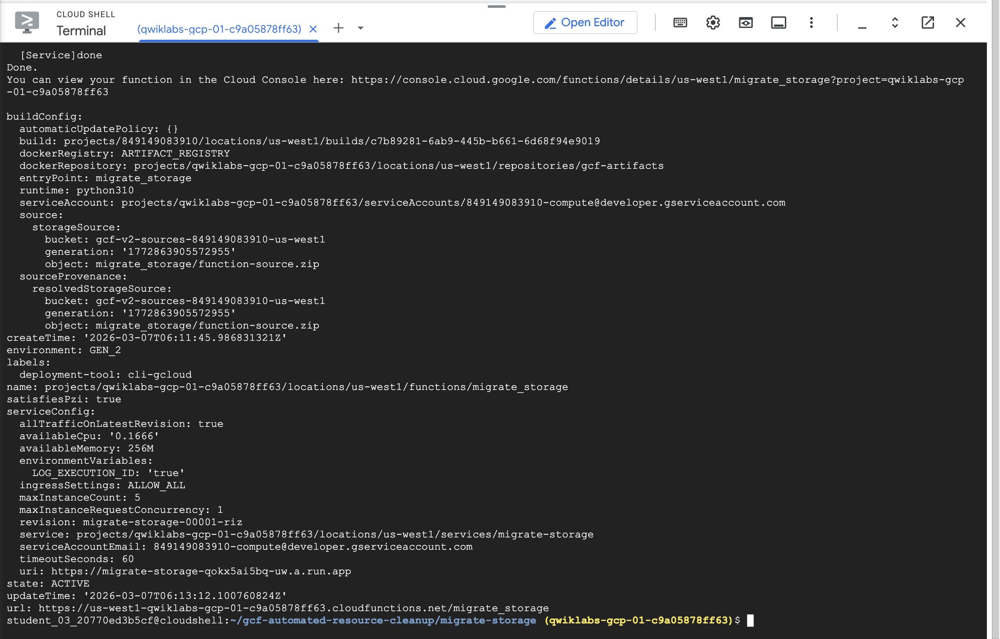

## Optimizing Cost with Google Cloud Storage

### Architecture

In the following diagram, you trigger a Cloud Run function to migrate a storage bucket to a less expensive storage class from a Cloud Monitoring alerting policy.

 

### Task 1. Enable APIs and download the source code

1. Enable APIs

    `gcloud services enable cloudscheduler.googleapis.com`

2. Download the source code for the lab:

    `gcloud storage cp -r gs://spls/gsp649/* . && cd gcf-automated-resource-cleanup/`

3. Set environment variables and make the repository folder your $WORKDIR where you run all commands related to this lab:

    `export PROJECT_ID=$(gcloud config list --format 'value(core.project)' 2>/dev/null)`
    
    `WORKDIR=$(pwd)`

4. Install Apache Bench
    `sudo apt-get update`
    `sudo apt-get install apache2-utils -y`

### Task 2. Create the Cloud Storage buckets and add a file

1. Navigate to the migrate-storage directory:

    `cd $WORKDIR/migrate-storage`

2. Create serving-bucket, the Cloud Storage bucket. You use this later to change storage classes:

    `export PROJECT_ID=$(gcloud config list --format 'value(core.project)' 2>/dev/null)`

    `gcloud storage buckets create  gs://${PROJECT_ID}-serving-bucket -l us-west1`

3. Make the bucket public:

    `gsutil acl ch -u allUsers:R gs://${PROJECT_ID}-serving-bucket`

4. Add a text file to the bucket:

    `gcloud storage cp $WORKDIR/migrate-storage/testfile.txt  gs://${PROJECT_ID}-serving-bucket`

5. Make the file public:

    `gsutil acl ch -u allUsers:R gs://${PROJECT_ID}-serving-bucket/testfile.txt`

6. Confirm that you’re able to access the file:

    `curl http://storage.googleapis.com/${PROJECT_ID}-serving-bucket/testfile.txt`

7. Create a second bucket called idle-bucket that won’t serve any data:

    `gcloud storage buckets create gs://${PROJECT_ID}-idle-bucket -l us-west1`
    
    `export IDLE_BUCKET_NAME=$PROJECT_ID-idle-bucket`

### Task 3. Create a monitoring dashboard



Create custom dashboard with name `Bucket Usage` and widget title is `Bucket Access` 

choose **Line**

For select a metric > GCS Bucket > Api > Request count metric and click Apply.

### Task 4. Generate load on the serving bucket

Send requests to the object in the serving bucket:

`ab -n 10000 http://storage.googleapis.com/$PROJECT_ID-serving-bucket/testfile.txt`



### Task 5. Review and deploy the Cloud Run function

1. View the Cloud Run function code that migrates a storage bucket to the Nearline storage class:

    `cat $WORKDIR/migrate-storage/main.py | grep "migrate_storage(" -A 15`

    

2. Update the Python script to use your Project ID:

    `sed -i "s/<project-id>/$PROJECT_ID/" $WORKDIR/migrate-storage/main.py`

3. Disable the Cloud Run functions API:

    `gcloud services disable cloudfunctions.googleapis.com`

4. Re-enable the Cloud Run functions API:

    `gcloud services enable cloudfunctions.googleapis.com`

5. Export the project number:

    `export PROJECT_NUMBER=$(gcloud projects describe $PROJECT_ID --format="value(projectNumber)")`

6. Add the artifactregistry.reader permission for your developer service account:

    ```
    gcloud projects add-iam-policy-binding $PROJECT_ID \
    --member="serviceAccount:$PROJECT_NUMBER-compute@developer.gserviceaccount.com" \
    --role="roles/artifactregistry.reader"
    ```

    

7. Deploy the Cloud Run function:

    `gcloud functions deploy migrate_storage --gen2 --trigger-http --runtime=python310 --region us-west1`

    

8. Capture the trigger URL into an environment variable that you use in the next section:

    `export FUNCTION_URL=$(gcloud functions describe migrate_storage --format=json --region us-west1 | jq -r '.url')`

### Task 6. Test and validate alerting automation

1. Update the JSON file with the bucket name:

    `export IDLE_BUCKET_NAME=$PROJECT_ID-idle-bucket`

    `sed -i "s/\\\$IDLE_BUCKET_NAME/$IDLE_BUCKET_NAME/" $WORKDIR/migrate-storage/incident.json`

2. Send a test notification to the Cloud Run function you deployed using the incident.json file:

    `envsubst < $WORKDIR/migrate-storage/incident.json | curl -X POST -H "Content-Type: application/json" $FUNCTION_URL -d @-`

3. Confirm that the idle bucket was migrated to Nearline:

    `gsutil defstorageclass get gs://$PROJECT_ID-idle-bucket`