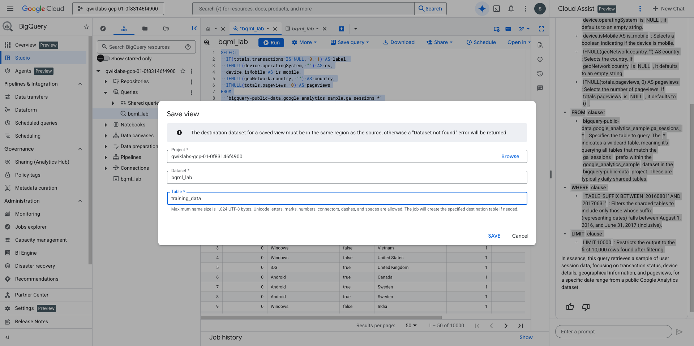
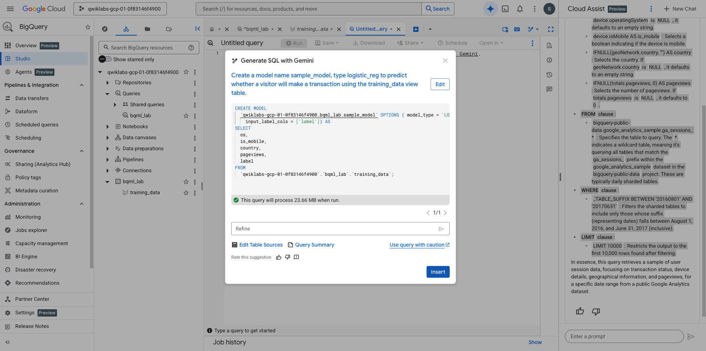
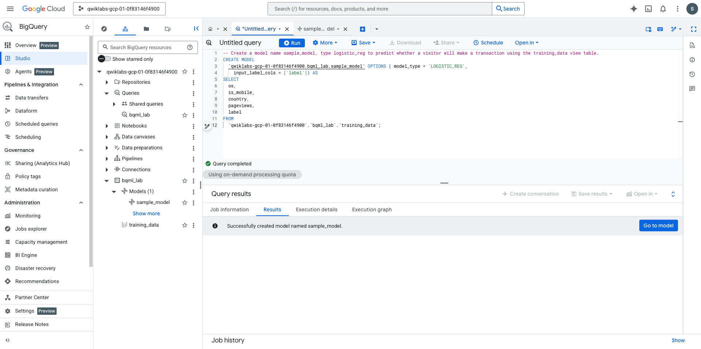
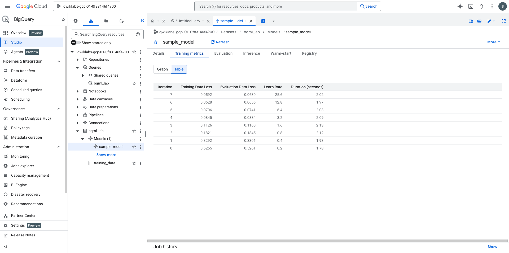
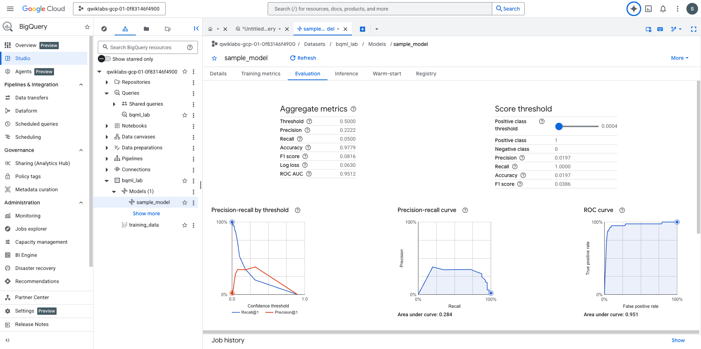
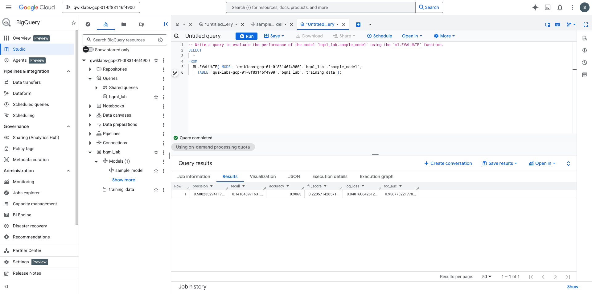
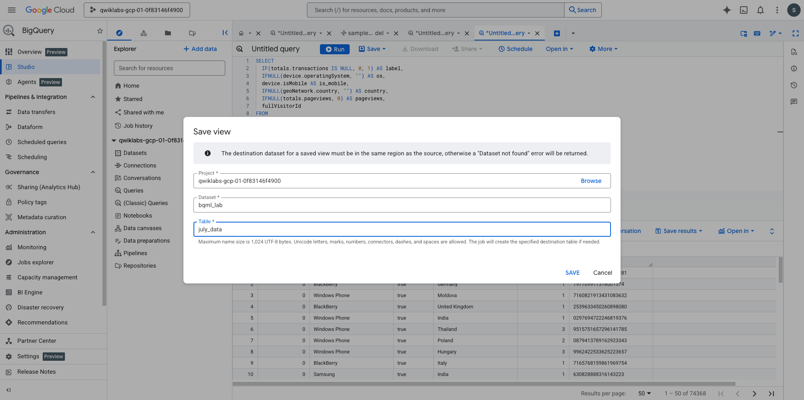
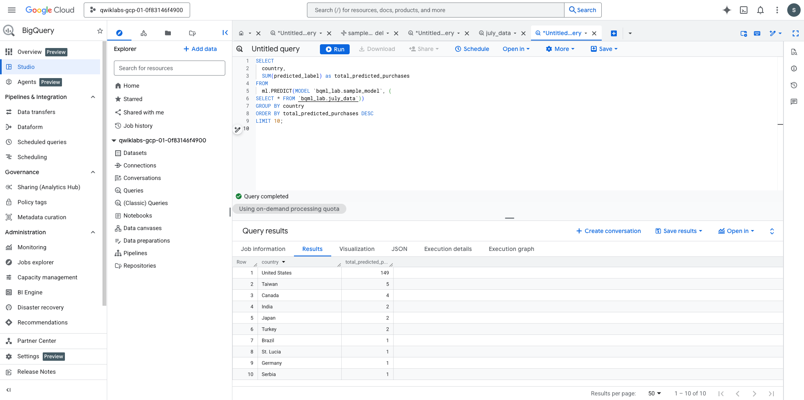
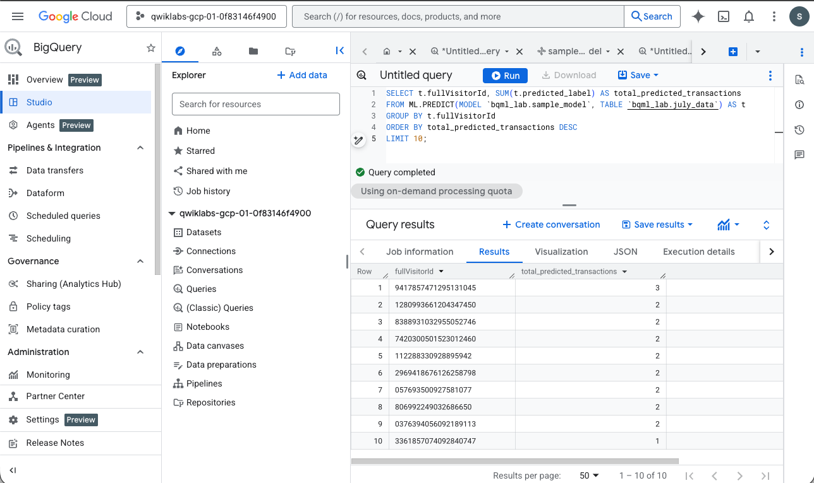

## Predict Visitor Purchases with BigQuery ML

### Task 1. Explore the data

```sql
SELECT
  IF(totals.transactions IS NULL, 0, 1) AS label,
  IFNULL(device.operatingSystem, "") AS os,
  device.isMobile AS is_mobile,
  IFNULL(geoNetwork.country, "") AS country,
  IFNULL(totals.pageviews, 0) AS pageviews
FROM
  `bigquery-public-data.google_analytics_sample.ga_sessions_*`
WHERE
  _TABLE_SUFFIX BETWEEN '20160801' AND '20170631'
LIMIT 10000;
```

Explanation from `Gemini`:

Here's a breakdown:

- SELECT clause :
    - IF(totals.transactions IS NULL, 0, 1) AS label : Creates a label column. If totals.transactions is NULL , it assigns 0 ; otherwise, it assigns 1 . This is often used for binary classification, indicating if a transaction occurred.
    - IFNULL(device.operatingSystem, "") AS os : Selects the operating system ( os ). If device.operatingSystem is NULL , it defaults to an empty string.
    - device.isMobile AS is_mobile : Selects a boolean indicating if the device is mobile.
    - IFNULL(geoNetwork.country, "") AS country : Selects the country. If geoNetwork.country is NULL , it defaults to an empty string.
    - IFNULL(totals.pageviews, 0) AS pageviews : Selects the number of pageviews. If totals.pageviews is NULL , it defaults to 0 .
- FROM clause : <br>
    bigquery-public-data.google_analytics_sample.ga_sessions_* : Specifies the table to query. The * indicates a wildcard table, meaning it's querying all tables that match the ga_sessions_ prefix within the google_analytics_sample dataset in the bigquery-public-data project. These are typically daily sharded tables.
- WHERE clause : <br>
    _TABLE_SUFFIX BETWEEN '20160801' AND '20170631' : Filters the sharded tables to include only those whose suffix (representing dates) falls between August 1, 2016, and June 31, 2017 (inclusive).

- LIMIT clause : <br>
    LIMIT 10000 : Restricts the output to the first 10,000 rows found after filtering.



### Task 2. Create a model

Generate a new machine learning model to predict visitor transactions using a SQL query natural language prompt in BigQuery. 

We specify a logistic regression model type and train it using the existing training_data, using prompt below:

`Create a model name sample_model, type logistic_reg to predict whether a visitor will make a transaction using the training_data view table.`

 <br>

 <br>

 <br>

 <br>

### Task 3. Evaluate the Model

Evaluate the performance of your machine learning model by using the ML.EVALUATE function. 

This provides key metrics that show how accurately the model predicts visitor transactions.

use the following prompt:
`Write a query to evaluate the performance of the model `bqml_lab.sample_model` using the `ml.EVALUATE` function.`

 <br>

### Task 4. Use the model

Use BigQuery's ML.PREDICT function to make predictions, but first, you must debug a query that uses an incorrect function. 

We will use Gemini to identify and correct the syntax error before running the query to predict the top 10 purchasing countries.

```sql

SELECT
  IF(totals.transactions IS NULL, 0, 1) AS label,
  IFNULL(device.operatingSystem, "") AS os,
  device.isMobile AS is_mobile,
  IFNULL(geoNetwork.country, "") AS country,
  IFNULL(totals.pageviews, 0) AS pageviews,
  fullVisitorId
FROM
  `bigquery-public-data.google_analytics_sample.ga_sessions_*`
WHERE
  _TABLE_SUFFIX BETWEEN '20170701' AND '20170801';
  ```

You'll realize the SELECT and FROM portions of the query is similar to that used to generate training data. 

There is the additional `fullVisitorId` column which you will use for predicting transactions by individual user.

The WHERE portion reflects the change in time frame (July 1 to August 1 2017).

 <br>

#### Predict purchases per country/region

Create new query:

```sql
SELECT
  country,
  SUM(predicted_label) as total_predicted_purchases
FROM
  ml.PREDICT(MODEL `bqml_lab.sample_model`, (
SELECT * FROM `bqml_lab.july_data`))
GROUP BY country
ORDER BY total_predicted_purchases DESC
LIMIT 10;
```

 <br>

#### Predict purchases per user

Predict the number of transactions each visitor makes, sort the results, and select the top 10 visitors by transactions.

Create new query:

```sql
SELECT
  country,
  SUM(predicted_label) as total_predicted_purchases
FROM
  ml.PREDICT(MODEL `bqml_lab.sample_model`, (
SELECT * FROM `bqml_lab.july_data`))
GROUP BY country
ORDER BY total_predicted_purchases DESC
LIMIT 10;
```

 <br>