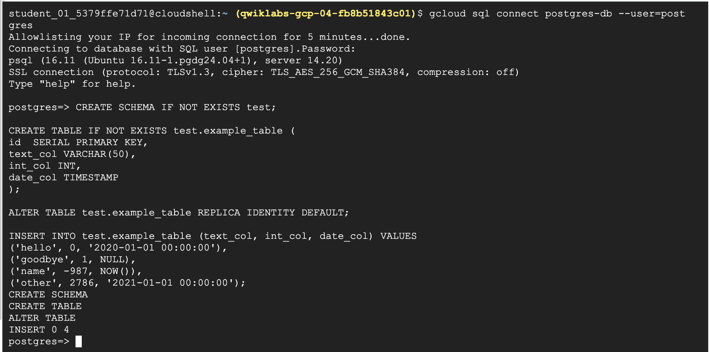
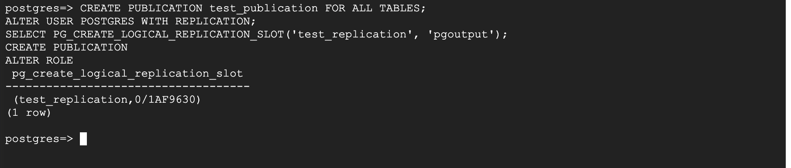
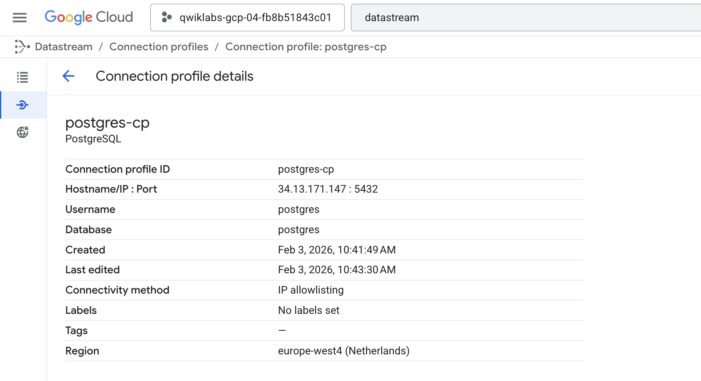
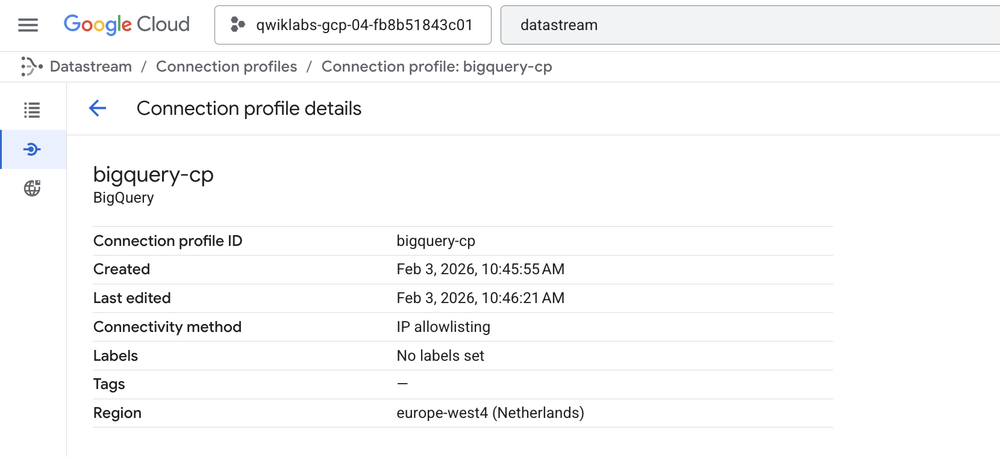
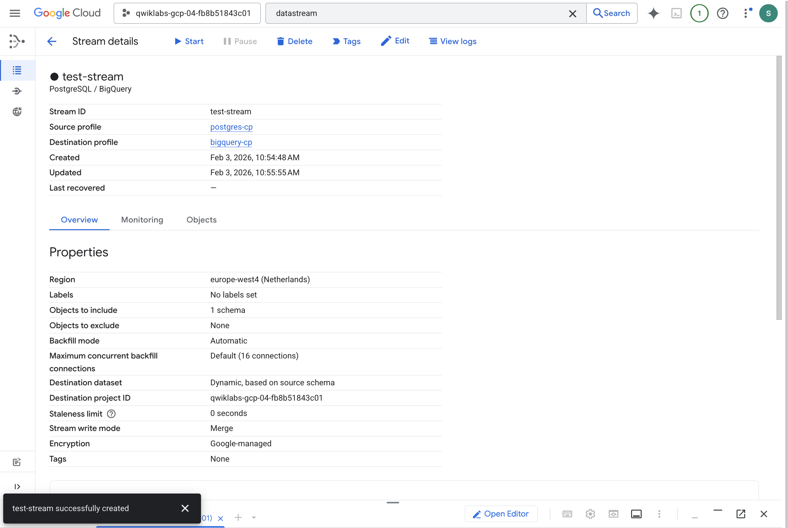
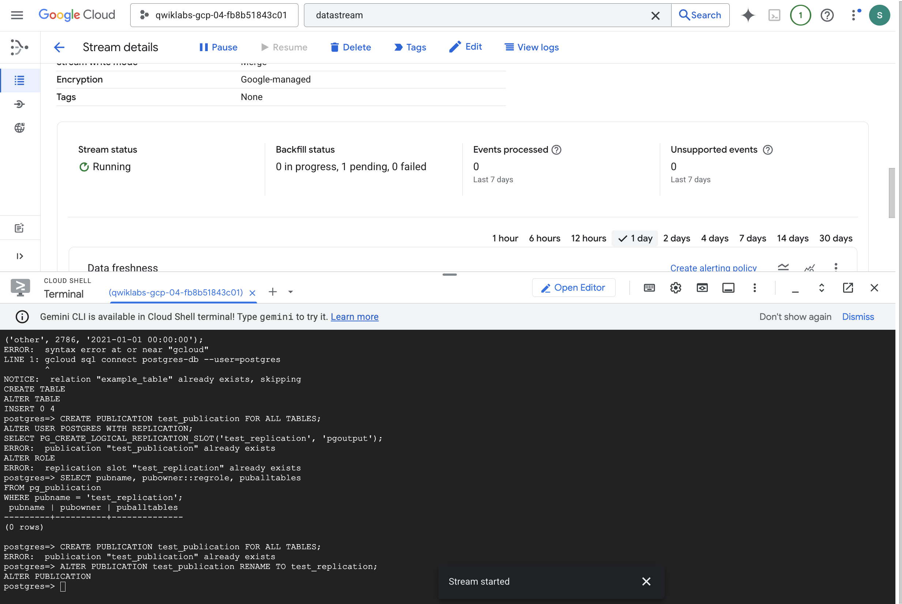

## Datastream: PostgreSQL Replication to BigQuery

as preparation :
Activate Cloud Shell

List the active account name `gcloud auth list`

List the project ID : `gcloud config list project`


in this steps we will enable two API:
1. Cloud SQL API 
2. Datastream API

### Task 1. Create a database for replication

#### Create the Cloud SQL database

1. Enable the Cloud SQL API `gcloud services enable sqladmin.googleapis.com`

   Output:

   > Operation "operations/acat.p2-842668110513-467ae38c-0f42-42a9-84ab-c4b4b7d04741" finished successfully.`

2. Create a Cloud SQL for PostgreSQL database instance:
    ```
    POSTGRES_INSTANCE=postgres-db
    DATASTREAM_IPS=34.72.28.29,34.67.234.134,34.67.6.157,34.72.239.218,34.71.242.81
    gcloud sql instances create \
        ${POSTGRES_INSTANCE} \
        --database-version=POSTGRES_14 \
        --cpu=2 --memory=10GB \
        --authorized-networks=${DATASTREAM_IPS} \
        --region=us-central1 \
        --root-password pwd \
        --database-flags=cloudsql.logical_decoding=on
    ```


#### Populate the database with sample data

`gcloud sql connect postgres-db --user=postgres`

When prompted for the password, enter pwd.

Once connected to the database, run the following SQL command to create a sample schema and table:

```sql
CREATE SCHEMA IF NOT EXISTS test;

CREATE TABLE IF NOT EXISTS test.example_table (
id  SERIAL PRIMARY KEY,
text_col VARCHAR(50),
int_col INT,
date_col TIMESTAMP
);

ALTER TABLE test.example_table REPLICA IDENTITY DEFAULT; 

INSERT INTO test.example_table (text_col, int_col, date_col) VALUES
('hello', 0, '2020-01-01 00:00:00'),
('goodbye', 1, NULL),
('name', -987, NOW()),
('other', 2786, '2021-01-01 00:00:00');
```



#### Configure the database for replication

Run the following SQL command to create a publication and a replication slot:

```sql
CREATE PUBLICATION test_publication FOR ALL TABLES;
ALTER USER POSTGRES WITH REPLICATION;
SELECT PG_CREATE_LOGICAL_REPLICATION_SLOT('test_replication', 'pgoutput');
```



### Task 2. Create the Datastream resources and start replication

#### Enable the Datastream API.

Now that the database is ready, create the Datastream connection profiles and stream to begin replication.

From the Navigation menu, click on View All Products under Analytics select Datastream

Click Enable to enable the Datastream API.

#### Create connection profiles

Create two connection profiles, one for the PostgreSQL source, and another for the BigQuery destination.

**PostgreSQL connection profile**

PostgreSQL connection profile
In the Cloud console, navigate to the Connection Profiles tab and click Create Profile.



#### BigQuery connection profile



#### Create stream



then start the "test-stream" stream.



### Task 3. View the data in BigQuery

### Task 4. Check that changes in the source are replicated to BigQuery

connect to the Cloud SQL database (the password is pwd): `gcloud sql connect postgres-db --user=postgres`

Run the following SQL commands to make some changes to the data:
```sql
INSERT INTO test.example_table (text_col, int_col, date_col) VALUES
('abc', 0, '2022-10-01 00:00:00'),
('def', 1, NULL),
('ghi', -987, NOW());

UPDATE test.example_table SET int_col=int_col*2; 

DELETE FROM test.example_table WHERE text_col = 'abc';

```

Open the BigQuery SQL workspace and run the following query to see the changes in BigQuery:

```sql
SELECT * FROM test.example_table ORDER BY id;
```