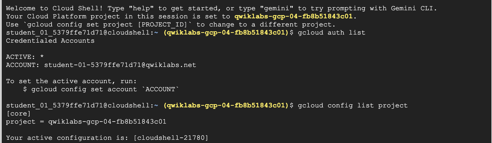
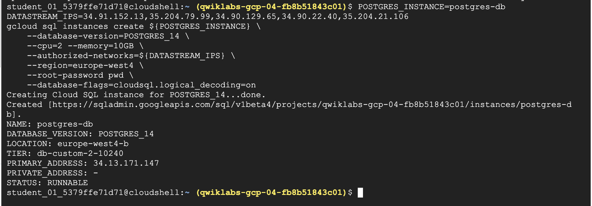

## Datastream: PostgreSQL Replication to BigQuery

Activate Cloud Shell

List the active account name `gcloud auth list`

List the project ID : `gcloud config list project`



### Task 1. Create a database for replication

#### Create the Cloud SQL database

1. Enable the Cloud SQL API `gcloud services enable sqladmin.googleapis.com`

   Output:

   > Operation "operations/acat.p2-842668110513-467ae38c-0f42-42a9-84ab-c4b4b7d04741" finished successfully.`

2. Create a Cloud SQL for PostgreSQL database instance:
    ```
    POSTGRES_INSTANCE=postgres-db
    DATASTREAM_IPS=34.72.28.29,34.67.234.134,34.67.6.157,34.72.239.218,34.71.242.81
    gcloud sql instances create \
        ${POSTGRES_INSTANCE} \
        --database-version=POSTGRES_14 \
        --cpu=2 --memory=10GB \
        --authorized-networks=${DATASTREAM_IPS} \
        --region=us-central1 \
        --root-password pwd \
        --database-flags=cloudsql.logical_decoding=on
    ```



#### Populate the database with sample data

`gcloud sql connect postgres-db --user=postgres`

When prompted for the password, enter pwd.


Once connected to the database, run the following SQL command to create a sample schema and table:

```sql
CREATE SCHEMA IF NOT EXISTS test;

CREATE TABLE IF NOT EXISTS test.example_table (
id  SERIAL PRIMARY KEY,
text_col VARCHAR(50),
int_col INT,
date_col TIMESTAMP
);

ALTER TABLE test.example_table REPLICA IDENTITY DEFAULT; 

INSERT INTO test.example_table (text_col, int_col, date_col) VALUES
('hello', 0, '2020-01-01 00:00:00'),
('goodbye', 1, NULL),
('name', -987, NOW()),
('other', 2786, '2021-01-01 00:00:00');
```

#### Configure the database for replication

Run the following SQL command to create a publication and a replication slot:

```sql
CREATE PUBLICATION test_publication FOR ALL TABLES;
ALTER USER POSTGRES WITH REPLICATION;
SELECT PG_CREATE_LOGICAL_REPLICATION_SLOT('test_replication', 'pgoutput');
```

### Task 2. Create the Datastream resources and start replication

#### Enable the Datastream API.

Now that the database is ready, create the Datastream connection profiles and stream to begin replication.

From the Navigation menu, click on View All Products under Analytics select Datastream

Click Enable to enable the Datastream API.

#### Create connection profiles

Create two connection profiles, one for the PostgreSQL source, and another for the BigQuery destination.

**PostgreSQL connection profile**

PostgreSQL connection profile
In the Cloud console, navigate to the Connection Profiles tab and click Create Profile.

Select the PostgreSQL connection profile type.

PostgreSQL tile one of the choices shown
For connection profile name type postgres-cp.

Enter the database connection details:

Region: us-central1
The IP and port of the Cloud SQL instance created earlier (Task 1)
To find the IP address of your Cloud SQL instance:
From the Navigation menu, click on Cloud SQL.
On the Cloud SQL page, locate your PostgreSQL instance named postgres-db.
Copy the public IP address of the instance.
Username: postgres
For password select Enter password manually and type pwd
Database: postgres
Click Continue.

For Encryption type, select None.

Select the IP allowlisting connectivity method, and click Continue.

Click RUN TEST to make sure that Datastream can reach the database.

Click Create.

BigQuery connection profile
In the Cloud console, navigate to the Connection Profiles tab and click Create Profile.
Connection profiles page with the Create Profile link in the upper right corner
Select the BigQuery connection profile type.
BigQuery tile one of the choices shown
For connection profile name type bigquery-cp.

Region us-central1

Click Create.

Create stream
Create the stream which connects the connection profiles created above and defines the configuration for the data to stream from source to destination.

In the Cloud console, navigate to the Streams tab and click Create stream.
Streams tab with create stream link in upper right corner
Define the stream details
For connection stream name type test-stream.
Region us-central1
Select PostgreSQL as the source type
Select BigQuery as destination type
Click Continue.
Define and test the source
Select the postgres-cp connection profile created in the previous step.
[Optional] Test connectivity by clicking Run Test
Click Continue.
Configure the source
Specify the replication slot name as test_replication.
Specify the publication name as test_publication.
Select the test schema for replication.
Click Continue.
Define the destination
Select the bigquery-cp connection profile created in the previous step, then click Continue.
Configure the destination
Choose Region and select us-central1 as the BigQuery dataset location.
Set the staleness limit to 0 seconds.
Click Continue.
Review and create the stream
Finally, validate the stream details by clicking Run Validation. Once validation completes successfully, click Create & Start then confirm Create & Start.
Wait approximately 1-2 minutes until the stream status is shown as running.

06

#### BigQuery connection profile

#### Create stream

### Task 3. View the data in BigQuery