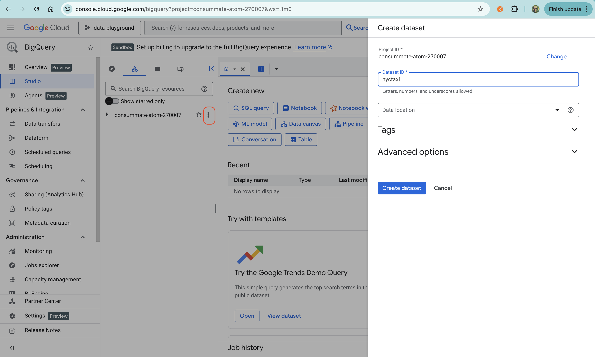
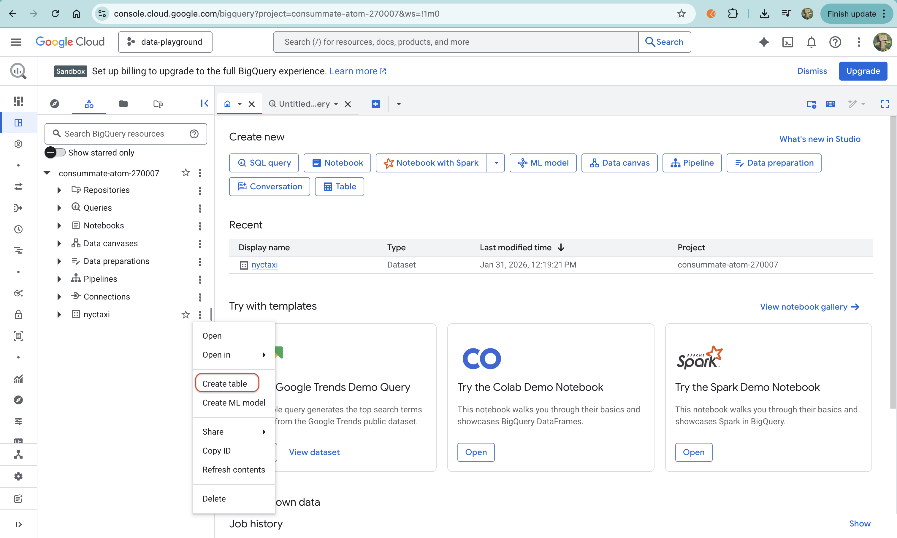
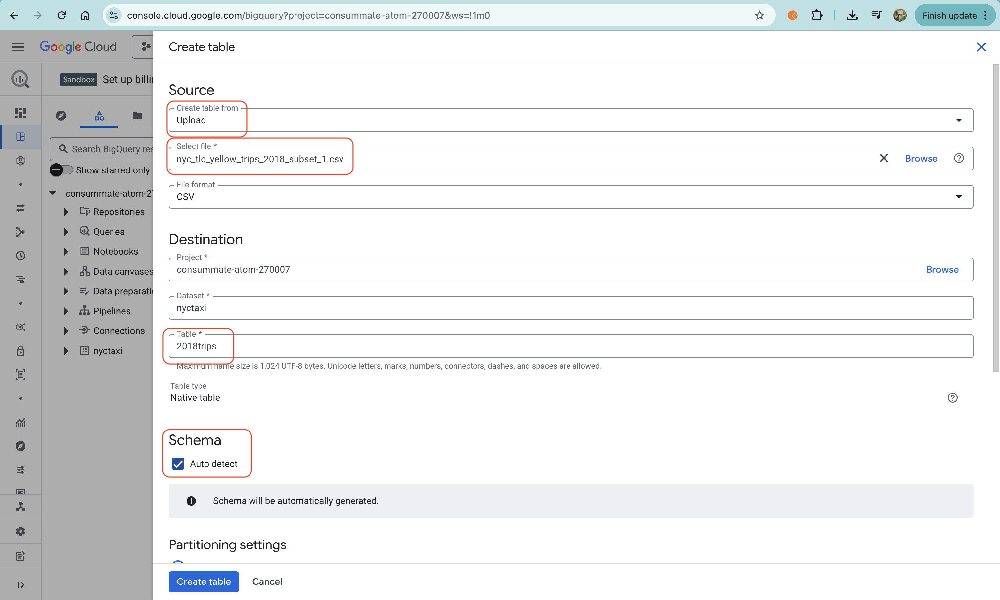
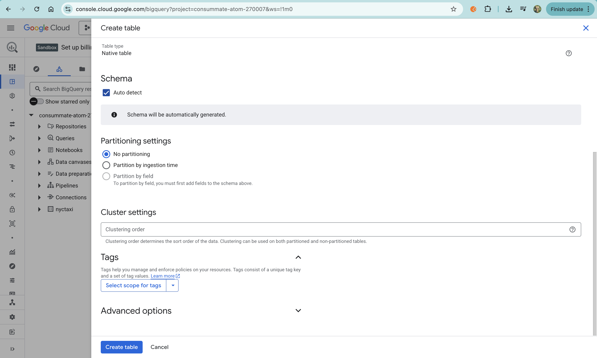
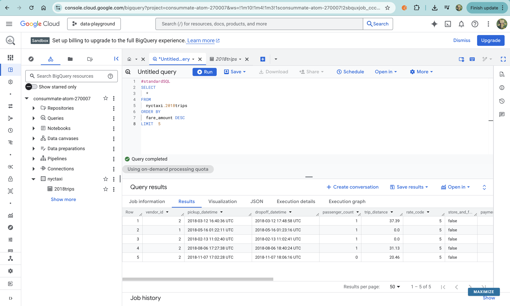
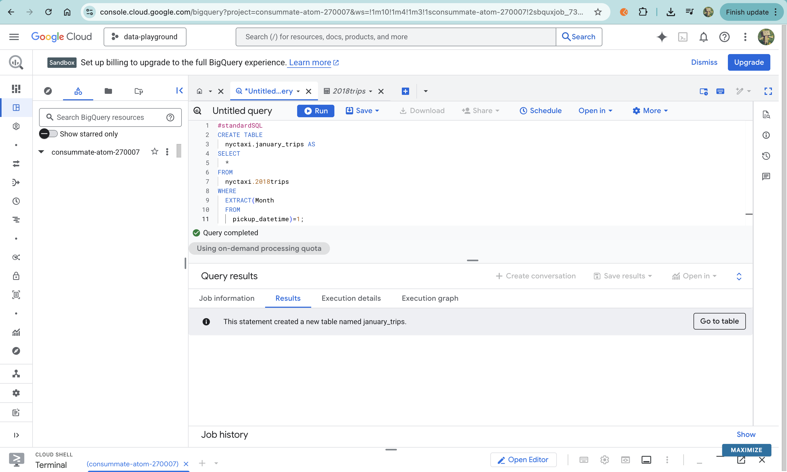
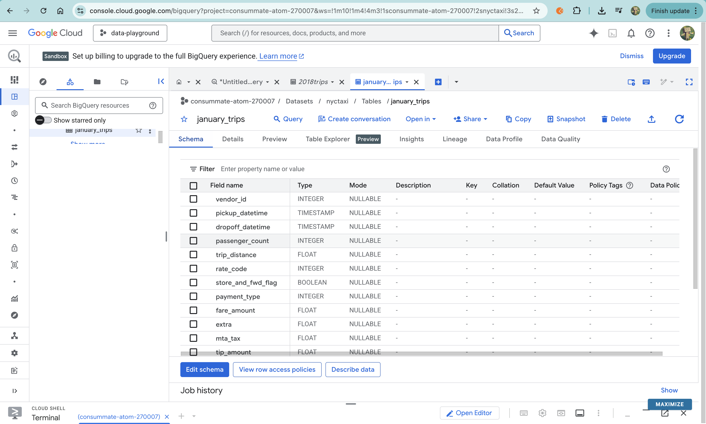
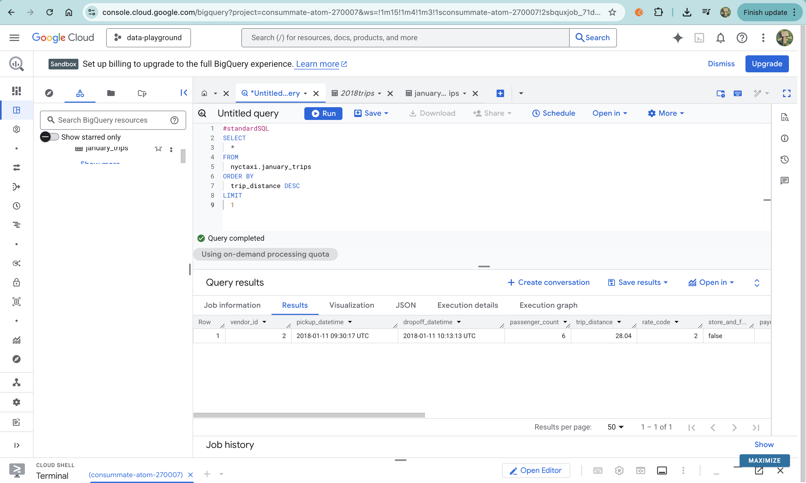

## GCP Bigquery - Load data

Today I worked through a hands-on lab from Google Skill Boost while preparing for the Associate Data Practitioner path on Google Cloud Platform.

The lab walked me through a few practical data tasks:

- Created a new dataset in Google BigQuery to organize tables

- Loaded data from a CSV file into BigQuery

- Imported another dataset from Google Cloud Storage

- Used SQL DDL to create new tables from existing ones

### Steps:

First, I clicked on my Project ID, opened the vertical three-dot menu, and chose Create dataset in Google BigQuery to organize where my tables would live.



Next, I create new table and uploaded a CSV file and loaded it into Google BigQuery as a new table — I only changed the fields highlighted in red and left the rest of the settings as default.

 <br>

<br>



After that, I ran a SQL query in Google BigQuery to explore the data by sorting trips with the highest fares:

```sql
#standardSQL
SELECT
  *
FROM
  nyctaxi.2018trips
ORDER BY
  fare_amount DESC
LIMIT 5
```



This helped me quickly view the top 5 most expensive trips in the dataset.


After that, I ingested another dataset directly from Google Cloud Storage using the bq load command:

```
bq load --source_format=CSV \
    --autodetect --noreplace \
    nyctaxi.2018trips \
    gs://cloud-training/OCBL013/nyc_tlc_yellow_trips_2018_subset_2.csv
```
This appended the new CSV data to the existing 2018trips table instead of replacing it.

Since the 2018trips table now contained data from the whole year, I wanted to focus only on trips from January.

In the Google BigQuery Query Editor, I used a DDL(Data Definition Language) statement to create a new table with just January trips:

```sql
#standardSQL
CREATE TABLE
  nyctaxi.january_trips AS
SELECT
  *
FROM
  nyctaxi.2018trips
WHERE
  EXTRACT(Month FROM pickup_datetime) = 1;

```

This pulled only the January records from the full 2018 dataset and saved them into a new table called january_trips.

<br>

<br>

After that, I ran another query to find the longest trip distance in January:



This helped quickly identify the single longest trip taken during that month.

---

Overall, it was a straightforward and helpful walkthrough for learning how to move and organize data in BigQuery.

```
Note for myself:

DDL is for creating and managing table structure, while CRUD is for creating, reading, updating, and deleting the data inside those tables.
```